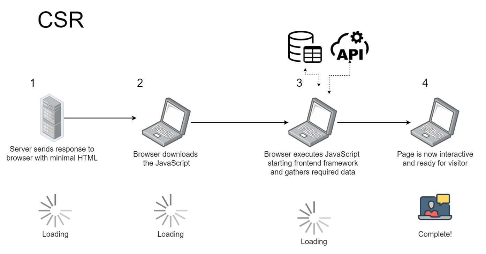
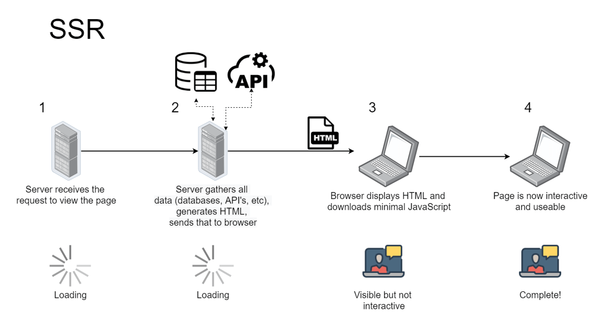
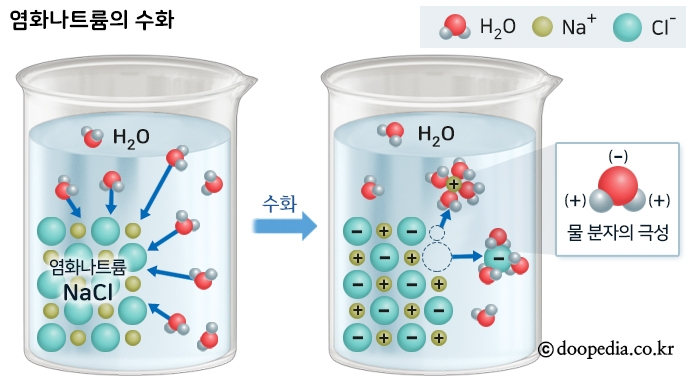

## 들어가며

근래에 Next.js와 함께 Server-Side-Rendering에 대한 인기가 매우 뜨겁다는걸 느낍니다.

18 버전 이전의 과거 React는 모두 브라우저에서 렌더링을 했었지만 React 18 이상에서는 reactDOM이 client / server로 분리되었고,

client에서 할 수 있는 rendering과 server에서 할 수 있는 rendering을 분리하고 있습니다.

[자세한 사항은 여기를 클릭하세요.](https://github.com/facebook/react/blob/main/CHANGELOG.md#1800-march-29-2022)

이런 시대적인 상황에 맞춰서 직접 구현해보며 이해를 확실히 하고자 합니다.

## 목표

우리의 목표는 버튼을 클릭했을 때 박스 내부의 background-color가 변경되는 코드를 CSR, SSR로 구현하는 것입니다.

<iframe class="example-frame" width="100%" height='330px' src="https://sonicce99.github.io/learn-csr-ssr/csr/index.html"></iframe>

배경 바꾸기 버튼을 클릭해보세요.

배경 색깔이 빨간색, 초록색으로 toggle 되는걸 확인 할 수 있습니다.

## 구현

### CSR

제가 생각했을 때 CSR을 가장 직관적으로 이해할 수 있다고 생각한 사진입니다.



총 4개의 단계가 있는데 그 중에 3단계가 Loading 중입니다.

아무래도 초기에 javascript 번들을 많이 로드해야하다보니 SSR보다 느리다는 단점이 있는것 같습니다.

SEO에 좋지 않다. 등 단점이 있지만 새로고침이 없다, interactive 하다는 장점들도 존재하죠.

본격적으로 들어가 보겠습니다!

#### 폴더 구조

```
csr
├── index.html    #root El 존재
├── component.js  #root El에 주입할 컴포넌트
└── index.js      #render 함수 존재
```

#### 제약사항

1. components를 분리하고 모듈화 하기 위해 index.html 내부의 \<script> 태그는 type='module'로 선언합니다.

2. 추후에 SSR에서 hydration 과정을 보기 위해 CSR에서도 css는 css-in-js 방식을 사용합니다.

#### Code

##### index.html

```js
<!DOCTYPE html>
<html lang="ko">
  <head>
    <meta charset="UTF-8" />
    <meta http-equiv="X-UA-Compatible" content="IE=edge" />
    <meta name="viewport" content="width=device-width, initial-scale=1.0" />
    <title>CSR | 동수의 로그북</title>
  </head>
  <body>
    <div id="root"></div>
    <script type="module" src="./index.js"></script>
  </body>
</html>
```

CSR의 \<body> 태그에는 root와 \<script> 하나만이 존재할 뿐입니다.

##### component.js

```js
export const Content = `
<h1>CSR을 배워보자</h1>
<div id='canvas'></div>
<button id='btn'>배경 바꾸기</button>
`
```

단순히 index.html에 주입되는 viewModel일 뿐입니다.

canvas라는 div 태그 하나와 btn이라는 버튼이 하나 존재합니다.

##### index.js

```js
import { Content } from "./component.js"

let isColorGreen = false

const render = () => {
  const $root = document.getElementById("root")
  $root.innerHTML = Content
  $root.querySelector("button").addEventListener("click", () => {
    const $canvas = document.getElementById("canvas")

    if (isColorGreen) {
      $canvas.style.backgroundColor = "red"
    } else {
      $canvas.style.backgroundColor = "green"
    }

    isColorGreen = !isColorGreen
  })
}

render()
```

여기 view가 있습니다.

동작은 단순합니다. canvas 박스의 색깔이 초록색인지 판별하는 isColorGreen 변수가 있고

배경 바꾸기 버튼이 클릭되었을 때 canvas 배경이 초록색이면 빨간색으로 바꾸고 빨간색이면 초록색으로 바꿉니다.

맨 처음에 목표 파트에서 보았던 것처럼 아주 잘 동작하는 것을 볼 수 있습니다. 👍🏻 👍🏻

<iframe class="example-frame" width="100%" height='330px' src="https://sonicce99.github.io/learn-csr-ssr/csr/index.html"></iframe>

#### Javascript 사용 중지

하지만 만약 javascript를 사용중지 한다면 어떻게 될까요?

javascript 사용중지는 Chrome의 경우

**개발자 도구 > 설정 > 환경설정 > 디버거**

에 있습니다.

<iframe class="example-frame" width="100%" height='550px' src="https://user-images.githubusercontent.com/87749134/218673327-f5bdd8ba-ca18-44e5-ba81-0ac8dc23eda6.gif"></iframe>

당연한 이야기이겠지만 javascript 동작을 중지한다면 내부의 canvas와 button은 사라지고 아무것도 할 수 없게 됩니다.

개발자도구의 Element에서도 찾아볼 수 없죠.

### SSR

SSR은 어떨까요? 서버에서 렌더링된 페이지를 전달 받으니, 브라우저에서 javascript 동작 중지를 한다고 해도 client는 화면을 볼 수 있지 않을까요?

물론 배경 바꾸기 버튼을 클릭해도 배경은 바뀌지 않겠지만요.

정말 그럴까요?



위의 사진을 보면 2번 단계에서 3번 단계로 갈 때 서버는 이미 HTML 파일을 브라우저로 전송하고 사용자는 볼 수 있다고 했습니다.

Visible 하지만 not interactive라고 사진에 설명이 되어 있네요.

한번 구현해보며 확인해보겠습니다!

#### 폴더 구조

```
ssr
├── package-lock.json
├── package.json        #express 설치를 위한 npm package 설치
├── server.js           #express 서버를 위한 코드
└── src
    ├── component.js    #CSR과 동일
    ├── hydrateRoot.js  #javascript를 동작시키기 위한 코드 (CSR의 index.js와 동일)
    └── template.js     #서버에서 html을 받기위한 템플릿
```

#### 제약사항

1. server를 사용해야하기 때문에 npm project로 실행해야하며 express를 설치합니다.

2. commonJS에서는 import, export 구문을 사용할 수 없음으로 require, module.exports를 통해 모듈을 가져오고 내보냅니다.

3. server에서 HTML을 만들고 전송하기 때문에 index.html이 필요하지 않습니다.

#### Code

##### src/component.js

```js
module.exports = `
<h1>SSR을 배워보자</h1>
<div id='canvas' style='width: 300px; height: 200px; border: 3px solid red;'></div>
<button id='btn'>배경 바꾸기</button>
`
```

CSR과 완전히 동일합니다.

다만 서버에서 실행되다보니 es6의 export로 내보내지 않고 module.exports를 통해 내보냅니다.

##### src/hydrateRoot.js

```js
let isColorGreen = false

const hydrateRoot = () => {
  const $btn = document.getElementById("btn")
  $btn.addEventListener("click", () => {
    const $canvas = document.getElementById("canvas")

    if (isColorGreen) {
      $canvas.style.backgroundColor = "red"
    } else {
      $canvas.style.backgroundColor = "green"
    }

    isColorGreen = !isColorGreen
  })
}

hydrateRoot()
```

CSR에서 index.js와 100% 동일한 코드입니다.

하지만 render에서 hydratinRoot라는 함수로 명칭이 바뀌었네요.

왜 바뀌었는지 더 밑에서 알아보겠습니다.

##### src/template.js

```js
const component = require("./component")

module.exports = `<!DOCTYPE html>
<html lang="ko">
  <head>
    <meta charset="UTF-8" />
    <meta http-equiv="X-UA-Compatible" content="IE=edge" />
    <meta name="viewport" content="width=device-width, initial-scale=1.0" />
    <title>SSR | 동수의 로그북</title>
  </head>
  <body>
    <div id="root">
        ${component}
    </div>
    <script src='./hydrateRoot.js'></script>
  </body>
</html>
`
```

component를 받아와서 HTML 파일을 만들고 해당 템플릿 리터럴을 내보냅니다.

역시나 서버에서 만드는 동작이므로 역시나 require, module.exports를 합니다.

🌟 다만 여기서 알아야될 한가지는 \<script> 태그입니다.

hydrateRoot.js는 배경 바꾸기 버튼을 클릭했을 떄 배경을 바꿔주는 javascript 파일입니다.

하지만 템플릿 리터럴을 통해 \<script>를 내보내면 hydrateRoot.js는 정상적으로 동작하지 않습니다.

이 과정은 hydration이라는 과정을 거쳐야하는데 더 밑에서 알아보도록 하겠습니다.

이렇게 만든 HTML string은 어디로 보내야 할까요?

서버로 보내야겠죠?

##### server.js

```js
const express = require("express")
const app = express()
const port = 7777

const templateHtml = require("./src/template")

app.get("/", (req, res) => {
  res.send(templateHtml)
})

app.listen(port, () => {
  console.log(`Example app listening on port ${port}`)
})
```

templateHtml이라는 아까 만들어둔 템플릿 리터널 HTML을 받아오고 client가 '/' 라우터를 타게되면 해당 HTML을 response 해줍니다.

이렇게 하면 어떻게 될까요? 서버에서 HTML이 왔으니 브라우저에서 javascript 동작 중지를 하고 새로고침을 하더라도 일단 HTML이 렌더링 되지 않을까요?

확인해봅시다!

<iframe class="example-frame" width="100%" height='550px' src="https://user-images.githubusercontent.com/87749134/218909930-69ab4b18-55fb-403e-a0a2-d909fbd07272.gif"></iframe>

위애서 몇 번 언급했던 대로 배경 바꾸기 버튼을 클릭해도 색깔이 변경되지 않는것을 확인합니다.

디버거에서 javascript 동작 중지를 하고 새로고침을 하더라도 client은 일단 렌더링된 화면을 볼 수 있습니다!! 😆

자 그러면 이제 버튼 클릭 시 canvas의 색깔을 바꿀 수 있게 해주어야겠죠?

#### hydraion

hydration이 무슨 뜻일까요?

네이버에 찾아보니 이러한 그림이 나옵니다.



**어떤 용매가 용액 속에서 용질 분자나 이온을 둘러싼 채, 그 전체가 하나의 분자처럼 행동하는 현상을 보일 때, 용질 분자나 이온이 용매화되었다고 말하며, 용매가 물인 경우를 특별히 hydraion라고 말한다.**

라고 되어 있습니다.

중요한 말은 _그 전체가 하나의 분자처럼 행동하는 현상_ 인 것 같습니다.

그럼 개발 용어에서 hydration은 뭘까요?

**바로 Server Side단에서 렌더링 된 정적 페이지와 번들링된 js파일을 client에게 보낸 뒤, client 단에서 HTML 코드와 React인 js 코드를 서로 매칭시키는 과정을 말합니다.**

바로 정적인 HTML을 interactive 하게 javascript를 입혀주는 과정이겠네요.

React 17버전까지는 hydrate() 라는 함수가 있었지만,

18버전 부터는 reactDOM이 client / server로 나눠지게 되면서 hydrateRoot() 라는 함수로 이름이 변경되었습니다.

```js
// 17버전 까지
import { hydrate } from "react-dom"

hydrate(reactNode, domNode)
```

```js
// 18버전 부터
import { hydrateRoot } from "react-dom/client"

const domNode = document.getElementById("root")
const root = hydrateRoot(domNode, reactNode)
```

[hydrateRoot에 대한 자세한 내용은 여기를 클릭하세요](https://beta.reactjs.org/reference/react-dom/client/hydrateRoot)

하지만 지금은 react로 hydration 작업을 하는게 아니고 vanilla javascript로 해야하니 이런 것들을 사용할 수 없겠지요.

어떻게 해야할까요?

바로 server.js를 아래와 같이 고치면 됩니다.

```js
const express = require("express")
const app = express()
const port = 7777

const templateHtml = require("./src/template")

app.get("/", (req, res) => {
  res.send(templateHtml)
})

app.use(express.static("src"))

app.listen(port, () => {
  console.log(`Example app listening on port ${port}`)
})
```

특별히 바뀐 것은 없습니다. 단지 express.static이 추가되었고 매개변수로 'src'를 전달하면 됩니다.

express.static을 사용하면 이미지, CSS 파일 및 JavaScript 파일과 같은 정적 파일을 제공할 수 있습니다.

아까 src/template.js에서 아래와 같은 \<script> 가 있었습니다.

```js
<script src="./hydrateRoot.js"></script>
```

app.use(express.static("src")) 을 설정하면 express는 해당 hydrateRoot.js를 실행 시키기위해 src 내부에 있는 파일을 순차적으로 검색합니다.

hydrateRoot.js 파일이 src 내부에 있으니 정상 동작 하겠지요.

최종 동작입니다.

<iframe class="example-frame" width="100%" height='550px' src="https://user-images.githubusercontent.com/87749134/218919654-4ad7d8ed-23d6-4686-b97f-9c9d7858dc3b.gif"></iframe>

client는 브라우저에서 javascript 동작 중지를 하고 새로고침을 해도 렌더링된 정적 파일을 미리 볼 수 있습니다.

다시 javascript 동작 중지를 해제한 후에 다시 새로고침해보면 사용자는 hydtation까지 된 최종 CSR과 같은 결과를 볼 수 있습니다.

## 마치며

저 역시도 명확하게 그려지지 않았던 부분을 직접 구현해보고 여러 블로그를 찾아보고 블로그를 써보며 더 확실히 개념을 적립할 수 있었던 그런 포스팅이였던 것 같습니다.

또한 지금은 vanilla javascript로 구현했지만 한 단계 더 나아가 추후에 React로도 구현해보면 더 좋은 공부가 될 것 같습니다.

혹시나 내용이 잘못된 부분이 있다면 sonicce99@naver.com 으로 알려주세요.

[해당 블로그의 code repository는 여기를 클릭하셔서 보시면 됩니다.](https://github.com/sonicce99/learn-csr-ssr)

긴 글을 읽어주셔서 감사합니다.
