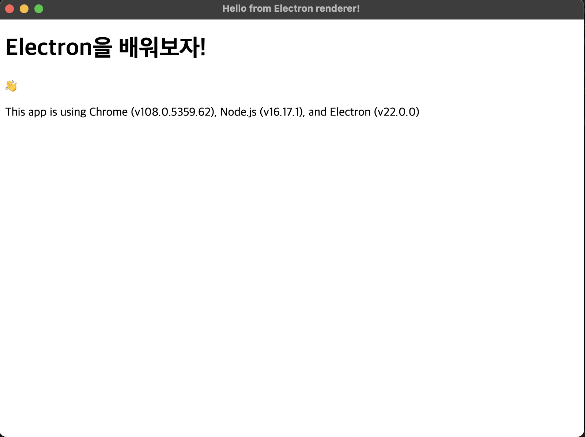
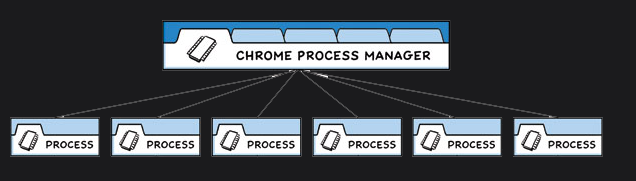

## Tutorial

### Prerequisites

Electron은 HTML, CSS, Javascript를 사용해 desktop application을 만들기 위한 프레임워크 입니다. ` Chromium` 과 `Node.js`을 single binary file에 추가함으로써, Electron은 Javascript 코드 베이스로 Windows, macOS, Linux에서 동작하는 cross-platform apps를 만들 수 있게 해줍니다.

이번 튜토리얼에서는 Electron을 사용해 desktop application을 개발하는 과정을 가이드합니다.

#### Goals

이 튜토리얼은 처음부터 최소한의 Electron 애플리케이션을 구성하는 과정을 안내하는 것으로 시작하여, Electron Forge를 사용하여 패키징하고 사용자에게 배포하는 방법을 알려줍니다.

만약 single-command boilerplate로 프로젝트를 시작하려면 Electron Forge의 `create-electron-app` 명령으로 시작하는 것이 좋습니다.

#### Assumptions

Electron은 Web apps을 위한 기본 wrapper layer이며 Node.js 환경에서 실행됩니다. 따라서 이번 튜토리얼에서는 일반적으로 Node 및 프론트엔드 웹 개발 기본에 익숙하다고 가정합니다.

### Building your First App

#### Learning goals

Electron 프로젝트를 set up하고 minimal starter application 을 작성하는 방법을 배웁니다. 이 section이 끝나면 터미널에서 development mode로 작동하는 Electron 앱을 실행할 수 있어야 합니다.

#### Setting up your project

```bash
mkdir my-electron-app && cd my-electron-app
npm init
```

`npm init`에서 따라야 할 몇 가지 규칙이 있습니다.

- entry point `main.js`이여야 합니다. (잠시 후에 생성할 예정입니다.)

- author, license 및 description는 어떤 값이든 가능하지만 나중에 패키징하는 데 필요합니다.

그 다음 `devDependencies`에 Electron을 설치합니다.

```bash
npm install electron --save-dev
```

👉🏻 왜 devDependencies인가요?

> production code가 Electron API를 실행하고 있기 때문에 이것은 직관에 반대되는 것처럼 보일 수 있습니다. 그러나 패키지 앱은 Electron 바이너리와 함께 번들로 제공되므로 이를 production dependency으로 지정할 필요가 없습니다.

패키지를 초기화하고 Electron을 설치한 후 package.json 파일은 다음과 같아야 합니다.

```json
// package.json
{
  "name": "my-electron-app",
  "version": "1.0.0",
  "description": "Hello World!",
  "main": "main.js",
  "author": "Dongsu Lee",
  "license": "MIT",

  "devDependencies": {
    "electron": "19.0.0"
  }
}
```

이제 Electron 실행 파일과 설치할 정확한 dependency version을 지정하는 package-lock.json 잠금 파일이 포함된 node_modules 폴더도 있어야 합니다.

#### Running an Electron app

package.json에 정의한 `main.js`는 모든 Electron 애플리케이션의 entry point입니다.

이 스크립트는 Node.js 환경에서 실행되는 main process를 제어하며 앱의 lifecycle 제어, 기본 인터페이스 표시, 권한이 있는 작업 수행 및 `renderer processes` 관리를 합니다.

첫 번째 Electron 앱을 만들기 전에 먼저 간단한 스크립트를 사용하여 main process entry point가 올바르게 구성되었는지 확인합니다.

한 줄의 코드로 프로젝트의 루트 폴더에 main.js 파일을 만듭니다.

```javascript
// main.js
console.log(`Hello from Electron 👋`)
```

Electron의 main process는 Node.js runtime이므로 electron 명령으로 임의의 Node.js 코드를 실행할 수 있습니다.

이 스크립트를 실행하려면 package.json의 scripts 필드에 있는 start command에 `electron .`을 추가하세요.

이 명령은 Electron 실행 파일이 현재 디렉토리에서 main.js를 찾고 development mode에서 실행하도록 지시합니다.

```json
{
  "name": "my-electron-app",
  "version": "1.0.0",
  "description": "Hello World!",
  "main": "main.js",
  "author": "Dongsu Lee",
  "license": "MIT",

  "scripts": {
    "start": "electron ."
  },

  "devDependencies": {
    "electron": "^19.0.0"
  }
}
```

```bash
npm run start
```

터미널에 Hello from Electron 👋이 출력되어야 합니다!

Electron에서 코드의 첫 줄을 실행했습니다!

다음으로 HTML을 사용하여 사용자 인터페이스를 만들고 이를 기본 창에 로드하는 방법을 배웁니다.

#### Loading a web page into a BrowserWindow

Electron에서 each window는 local HTML 파일 또는 remote 웹 주소에서 로드할 수 있는 웹 페이지를 표시합니다.

이 예에서는 로컬 파일에서 로드합니다.

프로젝트의 루트 폴더에 있는 index.html 파일에 웹 페이지를 생성하여 시작합니다.

```html
<!-- index.html -->
<!DOCTYPE html>
<html>
  <head>
    <meta charset="UTF-8" />
    <meta
      http-equiv="Content-Security-Policy"
      content="default-src 'self'; script-src 'self'"
    />
    <meta
      http-equiv="X-Content-Security-Policy"
      content="default-src 'self'; script-src 'self'"
    />
    <title>Hello from Electron renderer!</title>
  </head>
  <body>
    <h1>Hello from Electron renderer!</h1>
    <p>👋</p>
  </body>
</html>
```

이제 웹 페이지가 있으므로 `Electron BrowserWindow`에 로드할 수 있습니다.

main.js 파일의 내용을 다음 코드로 바꿉니다.

```javascript
// main.js
const { app, BrowserWindow } = require("electron")

const createWindow = () => {
  const win = new BrowserWindow({
    width: 800,
    height: 600,
  })

  win.loadFile("index.html")
}

app.whenReady().then(() => {
  createWindow()
})
```

첫 번째 줄에서는 CommonJS 모듈 구문을 사용하여 두 개의 Electron 모듈을 가져옵니다.

- app: application의 lifecycle를 제어합니다.

- BrowserWindow: app windows를 생성하고 관리합니다.

👉🏻 app과 BrowserWindow 모듈 사이의 대소문자 차이를 눈치채셨나요?

> Electron은 PascalCase 모듈이 인스턴스화 가능한 클래스 생성자(예: BrowserWindow, Tray, Notification)인 반면 camelCase 모듈은 인스턴스화할 수 없는(예: app, ipcRenderer, webContents) 일반적인 JavaScript 규칙을 따릅니다.

❗️ ECMAScript 모듈(ex: import를 사용하여 모듈 로드)은 현재 Electron에서 직접 지원되지 않습니다.

createWindow() 함수는 웹 페이지를 새 BrowserWindow 인스턴스로 로드합니다.

BrowserWindows는 앱 모듈의 ready 이벤트가 발생한 후에만 생성할 수 있습니다. promise가 fulfilled되면 app.whenReady() API를 사용하고 createWindow()를 호출하여 이 이벤트를 기다릴 수 있습니다.

이 시점에서 Electron 애플리케이션의 start command를 실행하면 웹 페이지를 표시하는 창이 성공적으로 열립니다!

앱이 창에 표시하는 각 웹 페이지는 renderer process라는 별도의 프로세스에서 실행됩니다.

renderer process는 일반적인 프론트엔드 웹 개발에 사용하는 것과 동일한 JavaScript API 및 도구에 액세스할 수 있습니다.

예를 들어 webpack을 사용하여 코드를 묶고 축소하거나 React를 사용하여 사용자 인터페이스를 구축할 수 있습니다.

#### Managing your app's window lifecycle

Application windows는 운영 체제 마다 다르게 작동합니다.

기본적으로 이러한 규칙을 적용하는 대신 Electron은 사용자가 이를 따르고자 할 경우 앱 코드에서 이를 구현할 수 있는 선택권을 제공합니다.

앱 및 BrowserWindow 모듈에서 발생하는 이벤트를 수신하여 기본 창 규칙을 구현할 수 있습니다.

📍 Node의 process.platform 변수를 확인하면 특정 플랫폼에서 조건부로 코드를 실행하는 데 도움이 될 수 있습니다.

Electron을 실행할 수 있는 플랫폼 종류

- win32(Windows)

- linux(Linux)

- darwin(macOS)

##### Quit the app when all windows are closed (Windows & Linux)

Windows 및 Linux에서 모든 창을 닫으면 일반적으로 응용 프로그램이 완전히 종료됩니다.

Electron 앱에서 이 패턴을 구현하려면 앱 모듈의 `window-all-closed` 이벤트를 수신하고 `app.quit()`를 호출하여 사용자가 macOS를 사용하지 않는 경우 앱을 종료합니다.

```javascript
app.on("window-all-closed", () => {
  if (process.platform !== "darwin") app.quit()
})
```

##### Open a window if none are open (macOS)

반대로 macOS 앱은 일반적으로 창이 열리지 않아도 계속 실행됩니다. 사용 가능한 창이 없을 때 앱을 활성화하면 새 창이 열립니다.

이 기능을 구현하려면 앱 모듈의 활성화 이벤트를 수신하고 열려 있는 BrowserWindows가 없는 경우 기존 createWindow() 메서드를 호출합니다.

ready 이벤트 전에 창을 만들 수 없기 때문에 앱이 초기화된 후에만 activate 이벤트를 수신해야 합니다. 기존 whenReady() 콜백 내에서 활성화 이벤트만 수신하면 됩니다.

```javascript
app.whenReady().then(() => {
  createWindow()

  app.on("activate", () => {
    if (BrowserWindow.getAllWindows().length === 0) createWindow()
  })
})
```

#### Final starter code

```javascript
const { app, BrowserWindow } = require("electron")

const createWindow = () => {
  const win = new BrowserWindow({
    width: 800,
    height: 600,
  })

  win.loadFile("index.html")
}

app.whenReady().then(() => {
  createWindow()

  app.on("activate", () => {
    if (BrowserWindow.getAllWindows().length === 0) {
      createWindow()
    }
  })
})

app.on("window-all-closed", () => {
  if (process.platform !== "darwin") {
    app.quit()
  }
})
```

#### Optional: Debugging from VS Code

VS Code를 사용하여 application을 디버깅하려면 main, renderer processes 모두에 VS Code를 연결해야 합니다.

프로젝트의 새 .vscode 폴더에 launch.json 구성을 만듭니다.

```json
// launch.json
{
  "version": "0.2.0",
  "compounds": [
    {
      "name": "Main + renderer",
      "configurations": ["Main", "Renderer"],
      "stopAll": true
    }
  ],
  "configurations": [
    {
      "name": "Renderer",
      "port": 9222,
      "request": "attach",
      "type": "chrome",
      "webRoot": "${workspaceFolder}"
    },
    {
      "name": "Main",
      "type": "node",
      "request": "launch",
      "cwd": "${workspaceFolder}",
      "runtimeExecutable": "${workspaceFolder}/node_modules/.bin/electron",
      "windows": {
        "runtimeExecutable": "${workspaceFolder}/node_modules/.bin/electron.cmd"
      },
      "args": [".", "--remote-debugging-port=9222"],
      "outputCapture": "std",
      "console": "integratedTerminal"
    }
  ]
}
```

sidebar에서 "실행 및 디버그" 버튼을 클릭하면 "Main + renderer" 옵션이 표시되어 중단점을 설정하고 Main, renderer 프로세스에서 모든 변수를 검사할 수 있습니다.

### Using Preload Scripts

#### Learning goals

`preload script`가 무엇인지, privileged APIs를 renderer process에 안전하게 노출하기 위해 스크립트를 사용하는 방법을 배우게 됩니다.

또한 Electron의 IPC(프로세스 간 통신) 모듈을 사용하여 main, renderer processes 간에 통신하는 방법을 배웁니다.

#### What is a preload script?

Electron의 main process는 전체 운영체제 접근 권한이 있는 Node.js 환경입니다.

Electron 모듈 외에도 Node.js 내장 및 npm을 통해 설치된 모든 패키지에 액세스할 수 있습니다.

반면 renderer processe는 웹 페이지를 실행하고 보안상의 이유로 기본적으로 Node.js를 실행하지 않습니다.

Electron의 서로 다른 프로세스 유형을 함께 연결하려면 preload라는 특수 스크립트를 사용해야 합니다.

#### Augmenting the renderer with a preload script

Preload scripts는 웹 페이지가 renderer에 load 되기 전에 injected 됩니다.

필요한 기능을 렌더러에 추가하려면 contextBridge API를 통해 global objects를 정의할 수 있습니다.

이 개념을 시연하기 위해 앱의 Chrome, Node 및 Electron 버전을 renderer에 노출하는 preload Script를 생성합니다.

Electron의 process.versions 개체의 선택된 속성을 version 전역 변수의 renderer process에 노출하는 새로운 preload.js 스크립트를 추가합니다.

```javascript
// preload.js
const { contextBridge } = require("electron")

contextBridge.exposeInMainWorld("versions", {
  node: () => process.versions.node,
  chrome: () => process.versions.chrome,
  electron: () => process.versions.electron,
  // we can also expose variables, not just functions
})
```

이 스크립트를 renderer process에 연결하려면 해당 경로를 BrowserWindow 생성자의 `webPreferences.preload` 옵션에 전달합니다.

```javascript
// main.js
const { app, BrowserWindow } = require("electron")
const path = require("path")

const createWindow = () => {
  const win = new BrowserWindow({
    width: 800,
    height: 600,
    webPreferences: {
      preload: path.join(__dirname, "preload.js"),
    },
  })

  win.loadFile("index.html")
}

app.whenReady().then(() => {
  createWindow()
})
```

여기에 사용되는 두 가지 Node.js 개념이 있습니다.

- \_\_dirname: 문자열은 현재 실행 중인 스크립트의 경로(이 경우 프로젝트의 루트 폴더)를 가리킵니다.

- path.join: 여러 경로를 결합하여 결합된 경로 문자열을 생성합니다.

자 정리하면 node.js에 있는 버전 정보를 preload.js의 `contextBridge`를 통해 main.js에 주입해주었습니다.

이제 renderer.js에서 사용할 수 있습니다!

```javascript
// renderer.js
const information = document.getElementById("info")
information.innerText = `This app is using Chrome (v${versions.chrome()}), Node.js (v${versions.node()}), and Electron (v${versions.electron()})`
```

```html
<!DOCTYPE html>
<html>
  <head>
    <meta charset="UTF-8" />
    <meta
      http-equiv="Content-Security-Policy"
      content="default-src 'self'; script-src 'self'"
    />
    <meta
      http-equiv="X-Content-Security-Policy"
      content="default-src 'self'; script-src 'self'"
    />
    <title>Hello from Electron renderer!</title>
  </head>
  <body>
    <h1>Electron을 배워보자!</h1>
    <p>👋</p>
    <p id="info"></p>
  </body>
  <script src="./renderer.js"></script>
</html>
```



### Communicating between processes

위에서 언급한 바와 같이 Electron의 main process와 renderer process는 서로 다른 역할을 하며 상호 교환할 수 없습니다.

즉, renderer process 에서 직접 Node.js API에 액세스하거나 main process에서 HTML DOM에 액세스할 수 없습니다.

이 문제에 대한 해결책은 프로세스 간 통신(IPC)을 위해 Electron의 `ipcMain` 및 `ipcRenderer` 모듈을 사용하는 것입니다.

웹 페이지에서 main process로 메시지를 보내려면 `ipcMain.handle`을 사용하여 main process handler를 설정한 다음 `ipcRenderer.invoke`를 호출하는 함수를 실행하여 preload script에서 handler를 trigger 할 수 있습니다.

```javascript
// renderer.js
const func = async () => {
  const response = await window.versions.ping()
  console.log(response) // prints out 'pong'
}

func()
```

```javascript
// preload.js
const { contextBridge, ipcRenderer } = require("electron")

contextBridge.exposeInMainWorld("versions", {
  node: () => process.versions.node,
  chrome: () => process.versions.chrome,
  ping: () => ipcRenderer.invoke("실행됨"),
  electron: () => process.versions.electron,
  // we can also expose variables, not just functions
})
```

```javascript
// main.js
const createWindow = () => {
  const win = new BrowserWindow({
    width: 800,
    height: 600,
    webPreferences: {
      preload: path.join(__dirname, "preload.js"),
    },
  })
  ipcMain.handle("실행됨", () => "실행!")
  win.loadFile("index.html")
}
```

❗️ contextBridge를 통해 ipcRenderer 모듈을 직접 노출하는 대신 helper 함수에서 ipcRenderer.invoke('실행됨') 호출을 래핑하는 방법에 주목하세요.
preload를 통해 전체 ipcRenderer 모듈을 직접 노출하고 싶지는 않습니다. 이렇게 하면 renderer가 임의의 IPC 메시지를 main process로 보낼 수 있는 기능이 제공되며, 이는 악성 코드에 대한 강력한 공격 벡터가 됩니다.

그런 다음 main process에서 handle listener를 설정합니다.

renderer에서 호출을 보내기 전에 핸들러가 준비되도록 HTML 파일을 로드하기 전에 이 작업을 수행합니다.

### Adding Features

#### Adding application complexity

여기까지 오셨다면 static user interface가 있는 Electron 애플리케이션이 있어야 합니다.

여기서부터 일반적으로 두 가지 방향으로 앱 개발을 진행할 수 있습니다.

- renderer process의 복잡성 추가

- 운영체제 와 Node.js와의 통합

이 두 가지 개념의 차이점을 이해하는 것이 중요합니다.

첫 번째로 Electron 전용 리소스는 필요하지 않습니다. Electron에서 to-do list을 만드는 것은 Electron BrowserWindow가 to-do list Web을 가리키는 것입니다.

궁극적으로 웹에서와 동일한 도구(HTML, CSS, JavaScript)를 사용하여 renderer의 UI를 구축하게 됩니다.

따라서 Electron의 문서는 standard web tools를 사용하는 방법에 대해 자세히 설명하지 않습니다.

한편, Electron은 데스크탑 환경과 통합할 수 있는 풍부한 도구를 제공합니다.

또한 main process 에서 Node.js 환경의 모든 기능을 제공합니다.

이 기능은 브라우저에서 웹사이트를 실행하는 것과 Electron 애플리케이션을 구분하며 Electron 문서의 초점입니다.

Electron의 문서에는 고급 주제와 더 깊은 운영체제 통합에 도움이 되는 많은 튜토리얼이 있습니다. 시작하려면 [How-To Examples](https://www.electronjs.org/docs/latest/tutorial/examples)를 확인하세요.

### Packaging Your Application

#### Learning goals

[Electron Forge](https://www.electronforge.io/)로 앱 패키징 및 배포의 기본 사항을 살펴보겠습니다.

#### Using Electron Forge

Electron에는 핵심 모듈에 번들로 제공되는 패키징 및 배포용 도구가 없습니다.

개발 모드에서 작동하는 Electron 앱이 있으면 추가 도구를 사용하여 사용자에게 배포할 수 있는 패키지 앱을 만들어야 합니다.

배포 가능 파일은 설치 프로그램(예: Windows의 MSI) 또는 이식 가능한 실행 파일(예: macOS의 .app)일 수 있습니다.

Electron Forge는 Electron 앱의 패키징 및 배포를 처리하는 올인원 도구입니다.

내부적으로는 많은 기존 Electron 도구(예: electron-packager, @electron/osx-sign, electron-winstaller 등)를 단일 인터페이스로 결합하므로 모두 함께 배선하는 것에 대해 걱정할 필요가 없습니다.

##### Importing your project into Forge

프로젝트의 devDependencies에 Electron Forge의 CLI를 설치하고 편리한 변환 스크립트를 사용하여 기존 프로젝트를 가져올 수 있습니다.

```bash
npm install --save-dev @electron-forge/cli
npx electron-forge import
```

설치가 완료되면 package.json 파일에 몇 가지 스크립트를 추가해야 합니다.

```json
// package.json
{
  // ...
  "scripts": {
    "start": "electron-forge start",
    "package": "electron-forge package",
    "make": "electron-forge make"
  }
  // ...
}
```

이제 package.json에 devDependencies 아래에 설치된 몇 가지 추가 패키지와 `forge.config.js` 파일이 있음을 알 수 있습니다.

각 대상 플랫폼에 하나씩 미리 채워진 구성에 여러 makers가 표시되어야 합니다.

##### Creating a distributable

배포 가능 파일을 생성하려면 electron-forge make 명령을 실행하는 프로젝트의 새로운 make 스크립트를 사용하십시오.

```bash
npm run make
```

이 make 명령에는 다음 두 단계가 포함됩니다.

먼저 Electron 바이너리와 함께 앱 코드를 번들로 제공하는 내부에서 electron-forge 패키지를 실행합니다. 패키지된 코드는 폴더에 생성됩니다.

그런 다음 이 패키지된 앱 폴더를 사용하여 구성된 각 maker에 대해 별도의 배포 가능 항목을 만듭니다.

스크립트가 실행된 후 배포 가능 파일이 포함된 out 폴더와 패키지된 애플리케이션 코드가 포함된 폴더가 표시되어야 합니다.

---

## Processes in Electron

### Process Model

Electron은 최신 웹 브라우저와 구조적으로 매우 유사하게 만드는 Chromium의 `multi-process architecture`를 상속합니다.

#### Why not a single process?

웹 브라우저는 엄청나게 복잡한 애플리케이션입니다.

웹 콘텐츠를 표시하는 기본 기능 외에도 여러 탭 관리 및 타사 확장 로드와 같은 많은 부차적인 책임이 있습니다.

이전에는 브라우저가 일반적으로 이 모든 기능에 대해 단일 프로세스를 사용했습니다.

이 패턴은 열려 있는 각 탭의 비용이 적다는 것을 의미하지만 웹 사이트 하나가 충돌하거나 응답하지 않으면 전체 브라우저에 영향을 미칩니다.

#### The multi-process model

이 문제를 해결하기 위해 Chrome 팀은 각 탭이 자체 프로세스에서 렌더링되어 웹 페이지의 버그 또는 악성 코드가 앱 전체에 미칠 수 있는 피해를 제한하기로 결정했습니다.

그러면 단일 브라우저 프로세스가 이러한 프로세스와 전체 애플리케이션 수명 주기를 제어합니다.

아래 다이어그램은 이 모델을 시각화합니다.



Electron applications은 매우 유사하게 구성됩니다. 개발자 main, renderer라는 두 가지 유형의 프로세스를 제어합니다.

이는 위에서 설명한 Chrome의 자체 브라우저 및 renderer processes와 유사합니다.

#### The main process

각 Electron 앱에는 Node.js 환경에서 실행되며, 애플리케이션의 진입점 역할을 하는 single main process가 있습니다.

즉, 모듈이 필요하고 모든 Node.js API를 사용할 수 있습니다.

##### Window management

main process의 주요 목적은 `BrowserWindow` 모듈을 사용하여 응용 프로그램 창을 만들고 관리하는 것입니다.

BrowserWindow 클래스의 각 인스턴스는 별도의 렌더러 프로세스에서 웹 페이지를 로드하는 응용 프로그램 창을 만듭니다.

창의 `webContents` 개체를 사용하여 main process에서 이 웹 콘텐츠와 상호 작용할 수 있습니다.

```javascript
const { BrowserWindow } = require("electron")

const win = new BrowserWindow({ width: 800, height: 1500 })
win.loadURL("https://github.com")

const contents = win.webContents
console.log(contents)
```

BrowserWindow 모듈은 `EventEmitter`이므로 다양한 사용자 이벤트(예: 창 최소화 또는 최대화)에 대한 핸들러를 추가할 수도 있습니다.

BrowserWindow 인스턴스가 파괴되면 해당 렌더러 프로세스도 종료됩니다.

##### Application lifecycle

main process는 또한 Electron의 app 모듈을 통해 애플리케이션의 수명 주기를 제어합니다.

이 app 모듈은 custom application behaviour을 추가하는 데 사용할 수 있는 대규모 event 및 method 집합을 제공합니다.

##### Native APIs

웹 콘텐츠용 Chromium 래퍼 이상으로 Electron의 기능을 확장하기 위해 main process는 운영체제와 상호 작용하는 custom APIs도 추가합니다.

Electron은 메뉴, 대화 상자 및 트레이 아이콘과 같은 기본 데스크톱 기능을 제어하는 ​​다양한 모듈을 노출합니다.

#### The renderer process

각 Electron 앱은 열려 있는 각 BrowserWindow에 대해 별도의 renderer process를 생성합니다.

이름에서 알 수 있듯이 renderer는 웹 콘텐츠 렌더링을 담당합니다.

모든 의도와 목적에 있어서 renderer process는 웹 표준에 따라 작동해야 합니다.

따라서 단일 브라우저 창 내의 모든 사용자 인터페이스와 앱 기능은 웹에서 사용하는 것과 동일한 도구 및 패러다임으로 작성되어야 합니다.

#### Preload scripts

Preload scripts에는 웹 콘텐츠가 로드되기 전에 renderer process에서 실행되는 코드가 포함되어 있습니다.

이러한 스크립트는 렌더러 컨텍스트 내에서 실행되지만 Node.js API에 대한 액세스 권한을 가짐으로써 더 많은 권한이 부여됩니다.

preload script는 BrowserWindow 생성자의 `webPreferences` 옵션에서 main process에 첨부할 수 있습니다.

```javascript
// main.js
const { BrowserWindow } = require("electron")
//...
const win = new BrowserWindow({
  webPreferences: {
    preload: "path/to/preload.js",
  },
})
//...
```

preload script는 렌더러와 전역 창 인터페이스를 공유하고 Node.js API에 액세스할 수 있으므로 웹 콘텐츠가 사용할 수 있는 전역 창에서 임의의 API를 노출하여 렌더러를 향상시키는 역할을 합니다.

preload script는 연결된 렌더러와 전역 창을 공유하지만 `contextIsolation default` 때문에 preload script에서 window로 변수를 직접 attach 할 수 없습니다.

```javascript
// preload.js
window.myAPI = {
  desktop: true,
}
```

```javascript
// renderer.js
console.log(window.myAPI)
// => undefined
```

Context Isolation 란 preload scripts가 renderer 격리되어 권한이 있는 API가 웹 콘텐츠 코드로 유출되는 것을 방지한다는 의미입니다.

대신 `contextBridge` 모듈을 사용하여 이를 안전하게 수행하세요.

```javascript
// preload.js
const { contextBridge } = require("electron")

contextBridge.exposeInMainWorld("myAPI", {
  desktop: true,
})
```

```javascript
// renderer.js
console.log(window.myAPI)
// => { desktop: true }
```

이 기능은 2가지 main purposes에 매우 유용합니다.

- ipcRenderer helper를 renderer에 노출시키면 IPC(프로세스 간 통신)를 사용하여 renderer에서 main process 작업을 트리거할 수 있습니다.

- 원격 URL에서 호스팅되는 기존 웹 앱용 Electron 래퍼를 개발하는 경우 웹 클라이언트 측의 데스크톱 전용 로직에 사용할 수 있는 렌더러의 전역 창에 custom properties을 추가할 수 있습니다.

#### The utility process

Electron 앱은 `UtilityProcess` API를 사용하여 main process에서 여러 하위 프로세스를 생성할 수 있습니다.

utility Process는 Node.js 환경에서 실행됩니다. 즉, 모듈을 요구하고 모든 Node.js API를 사용할 수 있습니다.

### Context Isolation

#### What is it?

Context Isolation는 preload script와 Electron의 internal 로직이 webContents에서 로드하는 웹사이트에 대해 별도의 컨텍스트에서 실행되도록 하는 기능입니다.

이는 웹사이트가 Electron 내부, preload script가 액세스할 수 있는 강력한 API에 접근하는 것을 방지하는 데 도움이 되므로 보안 목적에 중요합니다.

즉, preload script가 접근할 수 있는 window object는 실제 웹 사이트가 접근할 수 있는 object와 다른 개체입니다.

예를 들어 preload script에서 window.hello = 'wave'를 설정하고 context isolation이 활성화된 경우 웹 사이트에서 접근를 시도하면 window.hello가 정의되지 않습니다.

##### Before: context isolation disabled

preload script에서 renderer process의 로드된 웹사이트로 API를 노출하는 것은 일반적인 사용 사례입니다.

context isolation가 비활성화된 경우, preload script는 렌더러와 공통 전역 창 개체를 공유합니다.

그런 다음 preload script에 임의의 속성을 연결할 수 있습니다.

```javascript
// preload.js
// preload with contextIsolation disabled
window.myAPI = {
  doAThing: () => {},
}
```

그런 다음 renderer process 에서 doAThing() 함수를 직접 사용할 수 있습니다.

```javascript
// renderer.js
// use the exposed API in the renderer
window.myAPI.doAThing()
```

##### After: context isolation enabled

Electron에는 이 작업을 쉽게 수행할 수 있도록 도와주는 전용 모듈이 있습니다.

contextBridge 모듈을 사용하여 preload script의 격리된 컨텍스트에서 웹 사이트가 실행 중인 컨텍스트로 API를 안전하게 노출할 수 있습니다.

이전과 마찬가지로 window.myAPI의 웹 사이트에서도 API에 액세스할 수 있습니다.

```javascript
// preload.js
// preload with contextIsolation enabled
const { contextBridge } = require("electron")

contextBridge.exposeInMainWorld("myAPI", {
  doAThing: () => {},
})
```

그런 다음 renderer process 에서 doAThing() 함수를 직접 사용할 수 있습니다.

```javascript
// renderer.js
// use the exposed API in the renderer
window.myAPI.doAThing()
```

#### Security considerations

contextIsolation을 활성화하고 contextBridge를 사용한다고 해서 자동으로 모든 작업이 안전하다는 의미는 아닙니다.

예를 들어 이 코드는 안전하지 않습니다.

```javascript
// preload.js
// ❌ Bad code
contextBridge.exposeInMainWorld("myAPI", {
  send: ipcRenderer.send,
})
```

인수 필터링 없이 강력한 API를 직접 노출합니다.

이렇게 하면 모든 웹사이트에서 임의의 IPC 메시지를 보낼 수 있으며 이는 원하지 않는 것입니다.

대신 IPC 기반 API를 노출하는 올바른 방법은 IPC 메시지당 하나의 메서드를 제공하는 것입니다.

```javascript
// preload.js
// ✅ Good code
contextBridge.exposeInMainWorld("myAPI", {
  loadPreferences: () => ipcRenderer.invoke("load-prefs"),
})
```

### Inter-Process Communication

IPC(Inter-Process Communication)는 Electron에서 데스크톱 애플리케이션을 구축하는 핵심 부분입니다.

main, renderer processes는 Electron의 프로세스 모델에서 서로 다른 책임을 갖기 때문에 IPC는 UI에서 네이티브 API를 호출하거나 네이티브 메뉴에서 웹 콘텐츠의 변경 사항을 트리거하는 것과 같은 많은 일반적인 작업을 수행하는 유일한 방법입니다.

#### IPC channels

Electron에서 프로세스는 ipcMain 및 ipcRenderer 모듈과 함께 developer-defined "channels"을 통해 메시지를 전달하여 통신합니다.

이 가이드에서는 앱 코드에 대한 참조로 사용할 수 있는 구체적인 예제와 함께 몇 가지 기본 IPC 패턴을 살펴보겠습니다.

#### Understanding context-isolated processes

구현 세부 사항을 진행하기 전에 preload script를 사용하여 Node.js를 import해오는 것과 context-isolated renderer process에서 Electron 모듈을 가져오는것에 익숙해져야 합니다.

#### Pattern 1: Renderer to main (one-way)

[open in Fiddle](https://fiddle.electronjs.org/launch?target=electron/v22.0.0/docs/fiddles/ipc/pattern-1)

renderer process에서 main process로 단방향 IPC 메시지를 실행하려면 ipcRenderer.send API를 사용하여 메시지를 보낸 다음 ipcMain.on API에서 수신할 수 있습니다.

```html
<!-- index.html -->
<!DOCTYPE html>
<html>
  <head>
    <meta charset="UTF-8" />
    <!-- https://developer.mozilla.org/en-US/docs/Web/HTTP/CSP -->
    <meta
      http-equiv="Content-Security-Policy"
      content="default-src 'self'; script-src 'self'"
    />
    <title>Hello World!</title>
  </head>
  <body>
    Title: <input id="title" />
    <button id="btn" type="button">Set</button>
    <script src="./renderer.js"></script>
  </body>
</html>
```

```javascript
// renderer.js
const setButton = document.getElementById("btn")
const titleInput = document.getElementById("title")
setButton.addEventListener("click", () => {
  const title = titleInput.value
  window.electronAPI.setTitle(title)
})
```

```javascript
// preload.js
const { contextBridge, ipcRenderer } = require("electron")

contextBridge.exposeInMainWorld("electronAPI", {
  setTitle: title => ipcRenderer.send("set-title", title),
})
```

```javascript
// main.js
const { app, BrowserWindow, ipcMain } = require("electron")
const path = require("path")

function createWindow() {
  const mainWindow = new BrowserWindow({
    webPreferences: {
      preload: path.join(__dirname, "preload.js"),
    },
  })

  ipcMain.on("set-title", (event, title) => {
    const webContents = event.sender
    const win = BrowserWindow.fromWebContents(webContents)
    win.setTitle(title)
  })

  mainWindow.loadFile("index.html")
}

app.whenReady().then(() => {
  createWindow()

  app.on("activate", function () {
    if (BrowserWindow.getAllWindows().length === 0) createWindow()
  })
})

app.on("window-all-closed", function () {
  if (process.platform !== "darwin") app.quit()
})
```

#### Pattern 2: Renderer to main (two-way)

[open in Fiddle](https://fiddle.electronjs.org/launch?target=electron/v22.0.0/docs/fiddles/ipc/pattern-2)

양방향 IPC의 일반적인 애플리케이션은 renderer process 코드에서 main process 모듈을 호출하고 결과를 기다리는 것입니다.

이는 ipcMain.handle과 쌍을 이루는 ipcRenderer.invoke를 사용하여 수행할 수 있습니다.

```html
<!-- index.html -->
<!DOCTYPE html>
<html>
  <head>
    <meta charset="UTF-8" />
    <!-- https://developer.mozilla.org/en-US/docs/Web/HTTP/CSP -->
    <meta
      http-equiv="Content-Security-Policy"
      content="default-src 'self'; script-src 'self'"
    />
    <title>Dialog</title>
  </head>
  <body>
    <button type="button" id="btn">Open a File</button>
    File path: <strong id="filePath"></strong>
    <script src="./renderer.js"></script>
  </body>
</html>
```

```javascript
// renderer.js
const btn = document.getElementById("btn")
const filePathElement = document.getElementById("filePath")

btn.addEventListener("click", async () => {
  const filePath = await window.electronAPI.openFile()
  filePathElement.innerText = filePath
})
```

```javascript
// preload.js
const { contextBridge, ipcRenderer } = require("electron")

contextBridge.exposeInMainWorld("electronAPI", {
  openFile: () => ipcRenderer.invoke("dialog:openFile"),
})
```

```javascript
// main.js
const { app, BrowserWindow, ipcMain, dialog } = require("electron")
const path = require("path")

async function handleFileOpen() {
  const { canceled, filePaths } = await dialog.showOpenDialog()
  if (canceled) {
    return
  } else {
    return filePaths[0]
  }
}

function createWindow() {
  const mainWindow = new BrowserWindow({
    webPreferences: {
      preload: path.join(__dirname, "preload.js"),
    },
  })
  mainWindow.loadFile("index.html")
}

app.whenReady().then(() => {
  ipcMain.handle("dialog:openFile", handleFileOpen)
  createWindow()

  app.on("activate", function () {
    if (BrowserWindow.getAllWindows().length === 0) {
      createWindow()
    }
  })
})

app.on("window-all-closed", function () {
  if (process.platform !== "darwin") app.quit()
})
```

#### Pattern 3: Main to renderer

[open in Fiddle](https://fiddle.electronjs.org/launch?target=electron/v22.0.0/docs/fiddles/ipc/pattern-3)

main process에서 renderer process로 메시지를 보낼 때 메시지를 받는 렌더러를 지정해야 합니다.

메시지는 `WebContents` 인스턴스를 통해 renderer process로 전송되어야 합니다.

이 WebContents 인스턴스에는 ipcRenderer.send와 동일한 방식으로 사용할 수 있는 send 메서드가 포함되어 있습니다.

```javascript
// main.js
const { app, BrowserWindow, Menu, ipcMain } = require("electron")
const path = require("path")

function createWindow() {
  const mainWindow = new BrowserWindow({
    webPreferences: {
      preload: path.join(__dirname, "preload.js"),
    },
  })

  const menu = Menu.buildFromTemplate([
    {
      label: app.name,
      submenu: [
        {
          click: () => mainWindow.webContents.send("update-counter", 1),
          label: "Increment",
        },
        {
          click: () => mainWindow.webContents.send("update-counter", -1),
          label: "Decrement",
        },
      ],
    },
  ])

  Menu.setApplicationMenu(menu)
  mainWindow.loadFile("index.html")

  // Open the DevTools.
  mainWindow.webContents.openDevTools()
}

app.whenReady().then(() => {
  ipcMain.on("counter-value", (_event, value) => {
    console.log(value) // will print value to Node console
  })
  createWindow()

  app.on("activate", function () {
    if (BrowserWindow.getAllWindows().length === 0) createWindow()
  })
})

app.on("window-all-closed", function () {
  if (process.platform !== "darwin") app.quit()
})
```

```javascript
// preload.js
const { contextBridge, ipcRenderer } = require("electron")

contextBridge.exposeInMainWorld("electronAPI", {
  handleCounter: callback => ipcRenderer.on("update-counter", callback),
})
```

```html
<!-- index.html -->
<!DOCTYPE html>
<html>
  <head>
    <meta charset="UTF-8" />
    <!-- https://developer.mozilla.org/en-US/docs/Web/HTTP/CSP -->
    <meta
      http-equiv="Content-Security-Policy"
      content="default-src 'self'; script-src 'self'"
    />
    <title>Menu Counter</title>
  </head>
  <body>
    Current value: <strong id="counter">0</strong>
    <script src="./renderer.js"></script>
  </body>
</html>
```

```javascript
// renderer.js
const counter = document.getElementById("counter")

window.electronAPI.handleCounter((event, value) => {
  const oldValue = Number(counter.innerText)
  const newValue = oldValue + value
  counter.innerText = newValue
  event.sender.send("counter-value", newValue)
})
```

### Process Sandboxing

Chromium의 주요 보안 기능 중 하나는 샌드박스 내에서 프로세스를 실행할 수 있다는 것입니다.

샌드박스는 대부분의 시스템 리소스에 대한 접근을 제한하여 악성 코드가 유발할 수 있는 피해를 제한합니다.

샌드박스 프로세스는 CPU와 메모리만 자유롭게 사용할 수 있습니다.

추가 권한이 필요한 작업을 수행하기 위해 샌드박스 프로세스는 전용 통신 채널을 사용하여 더 많은 권한을 가진 프로세스에 작업을 위임합니다.

Chromium에서는 main process를 제외한 대부분의 프로세스에 샌드박싱이 적용됩니다.

여기에는 renderer processes는 물론 오디오 서비스, GPU 서비스 및 네트워크 서비스와 같은 utility process가 포함됩니다.

#### Sandbox behaviour in Electron

Electron의 샌드박스 프로세스는 대부분 Chromium과 동일한 방식으로 작동하지만 Electron은 Node.js와 인터페이스하기 때문에 고려해야 할 몇 가지 추가 개념이 있습니다.

##### Renderer processes

Electron의 renderer processes가 샌드박스 처리되면 일반 Chrome 렌더러와 동일한 방식으로 작동합니다.

샌드박스 렌더러는 Node.js 환경을 초기화하지 않습니다.

따라서 샌드박스가 활성화되면 렌더러 프로세스는 IPC를 통해 이러한 작업을 main process에 위임하여 권한 있는 작업(예: 파일 시스템과 상호 작용, 시스템 변경 또는 하위 프로세스 생성)만 수행할 수 있습니다.

##### Preload scripts

renderer processes가 main process와 통신할 수 있도록 샌드박스 렌더러에 연결된 preload scripts에는 여전히 사용 가능한 Node.js API의 폴리필 하위 집합이 있습니다.

Node의 require 모듈과 유사한 require 함수가 노출되지만 Electron 및 Node의 내장 모듈의 하위 집합만 가져올 수 있습니다.

#### Configuring the sandbox

대부분의 앱에서 샌드박싱이 최선의 선택입니다.

샌드박스와 호환되지 않는 특정 사용 사례에서는 특정 프로세스에 대해 샌드박스를 비활성화할 수 있습니다.

특히 샌드박스 처리되지 않은 프로세스에 신뢰할 수 없는 코드나 콘텐츠가 있는 경우 보안 위험이 따릅니다.

##### Disabling the sandbox for a single process

Electron에서 렌더러 샌드박싱은 BrowserWindow 생성자의 sandbox: false 기본 설정을 사용하여 프로세스별로 비활성화할 수 있습니다.

```javascript
// main.js
app.whenReady().then(() => {
  const win = new BrowserWindow({
    webPreferences: {
      sandbox: true,
    },
  })
  win.loadURL("https://google.com")
})
```
