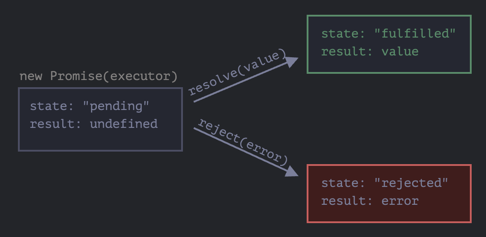

## 들어가며

요즈음 회사에서 OMS(주문 관리 시스템)를 개발하고 있다. OMS는 `Order Management System` 이다. 이 시스템에서 가장 중요한 부분중 하나는 판매자(우리한텐 고객)가 업로드한 엑셀을 정확하게 읽어와야한다는 점이다. 이 엑셀을 읽어와야 하는 부분에서 내가 중요하게 생각했던 점은 `SRP를 지키도록 코드를 분리하자` 이다. 이 고민의 끝에 `Promise` 를 활용해야겠다고 생각했으며 제대로 공부하고 이를 남겨보고자 한다.

## 기존 시스템의 한계점

위에서 언급했듯이 가장 중요하게 생각했던 점은 SRP이다. 기존 시스템은 업로드 함수가 업로드만 담당하고 있지 않았다. 온갖 state로 Props drilling이 심해 어디서 온 state인지 가늠하기가 어려웠으며, 하나의 함수에서 여러 state를 활용해 상태를 변경하여 상태가 어디서 어떻게 달라졌는지 가늠하기가 어려웠다.

📍 **따라서 최대한 excel 파일을 읽어오는 부분을 모듈화 시켜서 분리를 시켜야만 했다.**

## 엑셀을 읽는 방식

엑셀을 읽는 방식에는 여러가지가 있지만 현재 회사 로직에서 사용하는 방식은 2가지다.

- readAsArrayBuffer()

- readAsBinaryString()

회사에서 연동된 마켓은 여러가지가 있다. 네이버, 쿠팡, 인터파크 등등...

기존 시스템의 코드 flow를 대략적으로 살펴보면 다음과 같다.

```javascript
const reader = new FileReader();
 if (fileExt === 'xlsx' || fileExt === 'xls' || fileExt === 'csv') {
    reader.readAsArrayBuffer(file);
    reader.onload = (evt) => {
      // ... 엑셀을 읽어오는 로직 존재.

      // 읽어온 파일 데이터가 존재하면 특정 값들을 set 하는 로직 존재.
      if(firstSheetName) {
        ... setState(something)
      }

      // 읽어온 데이터가 없다면 다른 방식으로 읽어오도록 실행.
      else {
         reader.readAsBinaryString(file);
            reader.onload = () => {
              // ... 같은 동작 반복.
              ... setState(something)
            }
      }
      //
    }
 }
 else {
   ... setState(something)
 }
```

위와 같은 코드는 Clean 하지 않다고 생각했으며 확실하게 엑셀을 읽어오는 함수를 만들어서 여러 곳에서 해당 함수를 사용할 수 있게 해야겠다고 생각했다.

### 코드 개선 중 발생한 문제점?

```javascript
let worksheet = {};
reader.onload = (evt) => {
  worksheet = 읽어온 데이터
}

console.log(worksheet);
```

코드를 수정하다가 다음과 같은 문제점이 발생했다. 위와 같이 코드를 짜면 해당 console.log 에는 무엇이 찍힐까?

1. 제대로 읽어온 worksheet 값.

2. 빈 Object.

정답은 2번. 실행 결과 worksheet에는 제대로 값이 채워지지 않았다. 왜 그럴까?

_reader.onload() 함수는 `비동기 함수` 이기 때문이다._

비동기이기 때문에 제대로 된 값을 읽어오기 전에 기존의 빈 값이 찍혀버리는 것이다.

### 그래서 어떻게 해야해?

결국 해당 콘솔은 제대로 worksheet가 주입되면 동작되도록 만들어야 했고 고심 끝에 promise를 활용하기로 했다. **promise를 통해 worksheet를 읽어온 것이 제대로 resolve 되면 동작을 하도록 하면 되겠다** 라는 생각을 했기 때문이다.

---

## Promise가 뭐지?

- `promise`는 다음과 같은 문법으로 만들 수 있습니다.

```javascript
let promise = new Promise(function (resolve, reject) {
  // executor.
})
```

new Promise에 전달되는 함수는 executor(실행자, 실행 함수) 라고 부릅니다. executor는 new Promise가 만들어질 때 자동으로 실행됩니다.

executor의 인수 resolve와 reject는 `자바스크립트 엔진이 미리 정의한 자체 제공하는 콜백`입니다. 개발자는 resolve와 reject를 신경 쓰지 않고 executor 안 코드만 작성하면 됩니다.

대신 executor에선 결과를 즉시 얻든 늦게 얻든 상관없이 상황에 따라 인수로 넘겨준 콜백 중 하나를 반드시 호출해야 합니다.

- resolve(value) : 일이 성공적으로 끝난 경우 그 결과를 나타내는 value와 함께 호출

- reject(error) — 에러 발생 시 에러 객체를 나타내는 error와 함께 호출

new Promise 생성자가 반환하는 promise 객체는 다음과 같은 내부 프로퍼티를 갖습니다.

- `state` : 처음엔 `pending(보류)`이었다 resolve가 호출되면 `fulfilled`, reject가 호출되면 `rejected` 로 변합니다.

- `result` : 처음엔 `undefined`이었다 resolve(value)가 호출되면 value로, reject(error)가 호출되면 error로 변합니다.



❗️ 처리가 끝난 프라미스에 resolve와 reject를 호출하면 무시됩니다.

```javascript
let promise = new Promise(function (resolve, reject) {
  resolve("완료")

  reject(new Error("…")) // 무시됨
  setTimeout(() => resolve("…")) // 무시됨
})
```

❗️ 여기에 더하여 resolve나 reject는 **인수를 하나만** 받고(혹은 아무것도 받지 않음) `그 이외의 인수는 무시`한다는 특성도 있습니다.

### Promise.then((result, error))

then은 2가지의 인수를 받습니다. 만약 성공적으로 처리된 경우만 다루고 싶다면, then에 인수를 하나만 전달하면 됩니다.

```javascript
promise.then(
  function (result) {
    // resolve 시 실행되는 함수.
  },

  function (error) {
    // reject 시 실행되는 함수.
  }
)
```

```javascript
let promise = new Promise(function (resolve, reject) {
  setTimeout(() => resolve("완료!"), 1000)
})

// resolve 함수는 .then의 첫 번째 함수(인수)를 실행합니다.
promise.then(
  result => alert(result), // 1초 후 "완료!"를 출력
  error => alert(error) // 실행되지 않음
)
```

### Catch()

.then(result,error) {} 를 사용해도 되고,
.then(value).catch() 를 사용해도 되고,

에러가 발생한 경우만 다루고 싶다면 .then(null, fnc())을 사용하거나.
.then(null).catch를 사용해도 됩니다.

.catch(f)는 문법이 간결하다는 점만 빼고 .then(null,f)과 완벽하게 같습니다.

---

### Promise와 Error handling

Promise가 거부되면 제어 흐름이 가장 가까운 rejection 핸들러로 넘어가기 때문에 프라미스 체인을 사용하면 에러를 쉽게 처리할 수 있습니다.

체인 마지막의 .catch는 try..catch와 유사한 역할을 합니다. .then 핸들러를 원하는 만큼 사용하다 마지막에 .catch 하나만 붙이면 .then 핸들러에서 발생한 모든 에러를 처리할 수 있습니다.

```javascript
fetch("/article/promise-chaining/user.json") // 존재하지 않는 url이기 때문에 무조건 거부됨.
  .then(response => response.json()) // 무시됨
  .then(user => fetch(`https://api.github.com/users/${user.name}`)) // 무시됨
  .then(response => response.json()) // 무시됨
  .then(
    githubUser =>
      new Promise((resolve, reject) => {
        // 무시됨
        let img = document.createElement("img")
        img.src = githubUser.avatar_url
        img.className = "promise-avatar-example"
        document.body.append(img)

        setTimeout(() => {
          img.remove()
          resolve(githubUser)
        }, 3000)
      })
  )
  .catch(error => alert(error.message)) // 실행.
```

executor 주위의 '암시적 try..catch'는 스스로 에러를 잡고, 에러를 거부상태의 프라미스로 변경시킵니다.

이런 일은 executor 함수뿐만 아니라 핸들러에서도 발생합니다. .then 핸들러 안에서 throw를 사용해 에러를 던지면, 이 자체가 거부된 프라미스를 의미하게 됩니다. 따라서 제어 흐름이 가장 가까운 에러 핸들러로 넘어갑니다.

마지막 `.catch`는 이렇게 명시적인 거부뿐만 아니라 핸들러 위쪽에서 발생한 비정상 에러 또한 잡습니다.

```javascript
new Promise((resolve, reject) => {
  resolve("OK")
})
  .then(result => {
    blabla() // 존재하지 않는 함수
  })
  .catch(alert) // ReferenceError: blabla is not defined
```

### 다시 던지기

일반 try..catch에선 에러를 분석하고, 처리할 수 없는 에러라 판단되면 에러를 다시 던질 때가 있습니다. 프라미스에도 유사한 일을 할 수 있습니다.

.catch 안에서 throw를 사용하면 제어 흐름이 가장 가까운 곳에 있는 에러 핸들러로 넘어갑니다. 여기서 에러가 성공적으로 처리되면 **가장 가까운 곳에 있는 .then 핸들러로 제어 흐름이 넘어가 실행이 이어집니다.**

```javascript
// 실행 순서: catch -> then
new Promise((resolve, reject) => {
  throw new Error("에러 발생!")
})
  .catch(function (error) {
    alert("에러가 잘 처리되었습니다. 정상적으로 실행이 이어집니다.")
  })
  .then(() => alert("다음 핸들러가 실행됩니다."))
```

.catch 블록이 정상적으로 종료되었기 때문에 다음 성공 핸들러 .then이 호출된 것을 확인할 수 있습니다.

### 처리되지 못한 거부

에러가 발생하면 프라미스는 거부상태가 되고, 실행 흐름은 가장 가까운 rejection 핸들러로 넘어갑니다. 그런데 에러를 처리해줄 핸들러가 없다면?

끔찍한 일이 발생합니다. 🥲

자바스크립트 엔진은 프라미스 거부를 추적하다가 위와 같은 상황이 발생하면 `전역 에러`를 생성합니다. 콘솔창을 열고 위 예시를 실행하면 전역 에러를 확인할 수 있습니다.

브라우저 환경에선 이런 에러를 `unhandledrejection 이벤트`로 처리할 수 있습니다.

```javascript
window.addEventListener("unhandledrejection", function (event) {
  // unhandledrejection 이벤트엔 두 개의 특수 프로퍼티가 있습니다.
  alert(event.promise) // [object Promise] - 에러를 생성하는 프라미스
  alert(event.reason) // Error: 에러 발생! - 처리하지 못한 에러 객체
})

new Promise(function () {
  throw new Error("에러 발생!")
}) // 에러를 처리할 수 있는 .catch 핸들러가 없음
```

---

## Promise Api

Promise 클래스에는 5가지 정적 메서드가 있습니다.

1. Promise.all

> 여러개의 Promise를 동시에 실행 시키고 모든 promise가 준비될 때까지 기다려야 할 때 사용.

2. Promise.allSettled

> 모든 프라미스가 처리될 때까지 기다립니다. promise.all은 promise가 하나라도 거절되면 전체를 거절하지만 promise.allSettled는 여러 요청 중 하나가 실패하도 동작합니다.

3. Promise.race

> Promise.all과 비슷합니다. 다만 가장 먼저 처리되는 프라미스의 결과(혹은 에러)를 반환합니다.

4. Promise.resolve

5. Promise.reject

- 프라미스 메서드 Promise.resolve와 Promise.reject는 async/await 문법(뒤에서 다룸)이 생긴 후로 쓸모없어졌기 때문에 근래에는 거의 사용하지 않습니다.

### Promise.all ?

여러 개의 프라미스를 동시에 실행시키고 모든 프라미스가 준비될 때까지 기다린다고 해봅시다.

```javascript
let promise = Promise.all([...promises...]);
```

Promise.all은 요소 전체가 프라미스인 배열(엄밀히 따지면 이터러블 객체이지만, 대개는 배열임)을 받고 새로운 프라미스를 반환합니다.

배열 안 프라미스가 모두 처리되면 새로운 프라미스가 이행되는데, 배열 안 프라미스의 결괏값을 담은 배열이 새로운 프라미스의 result가 됩니다.

```javascript
Promise.all([
  new Promise(resolve => setTimeout(() => resolve(1), 3000)), // 1
  new Promise(resolve => setTimeout(() => resolve(2), 2000)), // 2
  new Promise(resolve => setTimeout(() => resolve(3), 1000)), // 3
]).then(alert) // 프라미스 전체가 처리되면 1, 2, 3이 반환됩니다. 각 프라미스는 배열을 구성하는 요소가 됩니다.
```

🌟 배열 result의 요소 순서는 Promise.all에 전달되는 프라미스 순서와 상응한다는 점에 주목해 주시기 바랍니다. Promise.all의 첫 번째 프라미스는 _가장 늦게 이행되더라도 처리 결과는 배열의 첫 번째 요소에 저장_ 됩니다.

❗️ Promise.all에 전달되는 프라미스 중 `하나라도 거부되면`, Promise.all이 반환하는 프라미스는 에러와 함께 바로 거부됩니다.

```javascript
Promise.all([
  new Promise((resolve, reject) => setTimeout(() => resolve(1), 1000)),
  new Promise((resolve, reject) =>
    setTimeout(() => reject(new Error("에러 발생!")), 2000)
  ),
  new Promise((resolve, reject) => setTimeout(() => resolve(3), 3000)),
]).catch(alert) // Error: 에러 발생!
```

📍 이터러블 객체가 아닌 `일반값` 도 Promise.all(iterable)에 넘길 수 있습니다.

```javascript
Promise.all([
  new Promise((resolve, reject) => {
    setTimeout(() => resolve(1), 1000)
  }),
  2,
  3,
]).then(alert) // 1, 2, 3
```

### Promise.allSettled

❗️ 스펙에 추가된 지 얼마 안 된 문법입니다. 구식 브라우저는 `폴리필`이 필요합니다.

fetch를 사용해 여러 사람의 정보를 가져오고 있다고 해봅시다. 여러 요청 중 하나가 실패해도 다른 요청 결과는 여전히 필요합니다.

```javascript
let urls = [
  "https://api.github.com/users/iliakan",
  "https://api.github.com/users/Violet-Bora-Lee",
  "https://no-such-url",
]

Promise.allSettled(urls.map(url => fetch(url))).then(results => {
  // (*)
  results.forEach((result, num) => {
    if (result.status == "fulfilled") {
      alert(`${urls[num]}: ${result.value.status}`)
    }
    if (result.status == "rejected") {
      alert(`${urls[num]}: ${result.reason}`)
    }
  })
})
```

(\*)로 표시한 줄의 results는 다음과 같을 겁니다.

```javascript
[
  {status: 'fulfilled', value: ...응답...},
  {status: 'fulfilled', value: ...응답...},
  {status: 'rejected', reason: ...에러 객체...}
]
```

🌟 Promise.allSettled를 사용하면 이처럼 `각 프라미스의 상태와 값 또는 에러를 받을 수 있습니다.`

### Promise.race

Promise.race는 Promise.all과 비슷합니다. _다만 가장 먼저 처리되는 프라미스의 결과(혹은 에러)를 반환합니다._

```javascript
Promise.race([
  new Promise((resolve, reject) => setTimeout(() => resolve(1), 1000)),
  new Promise((resolve, reject) =>
    setTimeout(() => reject(new Error("에러 발생!")), 2000)
  ),
  new Promise((resolve, reject) => setTimeout(() => resolve(3), 3000)),
]).then(alert) // 1
```

---

## async await

function 앞에 async를 붙이면 해당 함수는 항상 프라미스를 반환합니다. 프라미스가 아닌 값을 반환하더라도 이행 상태의 프라미스(resolved promise)로 값을 감싸 이행된 프라미스가 반환되도록 합니다.

자바스크립트는 await 키워드를 만나면 프라미스가 처리될 때까지 기다립니다. 결과는 그 이후 반환됩니다.

await 뒤에 오는 녀석은 promise를 반환해야 합니다.

```javascript
async function f() {
  let promise = new Promise((resolve, reject) => {
    setTimeout(() => resolve("완료!"), 1000)
  })

  let result = await promise // 프라미스가 이행될 때까지 기다림 (*)

  alert(result) // "완료!"
}

f()
```

함수를 호출하고, 함수 본문이 실행되는 도중에 (\*)로 표시한 줄에서 실행이 잠시 `중단` 되었다가 프라미스가 처리되면 실행이 재개됩니다. 이때 프라미스 객체의 result 값이 변수 result에 할당됩니다. 따라서 위 예시를 실행하면 1초 뒤에 '완료!'가 출력됩니다.

await는 말 그대로 프라미스가 처리될 때까지 함수 실행을 기다리게 만듭니다. 프라미스가 처리되면 그 결과와 함께 실행이 재개되죠. **프라미스가 처리되길 기다리는 동안엔 엔진이 다른 일(다른 스크립트를 실행, 이벤트 처리 등)을 할 수 있기 때문에, CPU 리소스가 낭비되지 않습니다.**

await는 promise.then보다 좀 더 세련되게 프라미스의 result 값을 얻을 수 있도록 해주는 문법입니다. promise.then보다 가독성 좋고 쓰기도 쉽습니다.

---

## 그래서 문제를 어떻게 해결했어?

- 파일을 읽어오는 함수 하나를 만들고 엑셀을 업로드 받는 모든 컴포넌트에 적용

```javascript
// file을 읽어서 worksheet를 반환하는 Promise 반환 함수 생성.
const excelFileReadFnc = (file) => {
  const reader = new FileReader();
  reader.readAsBinaryString(file);

  const workwheet = new Promise((resolve, reject) => {
    reader.onload = (e) => {
      // ... 파일 읽어오는 동작

      resolve(읽어온 데이터);
    };
  });
  return workwheet;
};
```

```javascript
// async await 으로 worksheet return 받아 사용.
const worksheet = await excelFileReadFnc(file)
```
