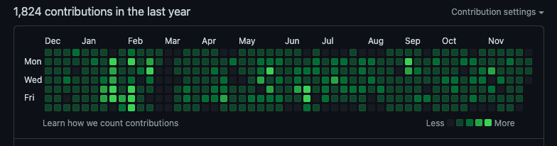
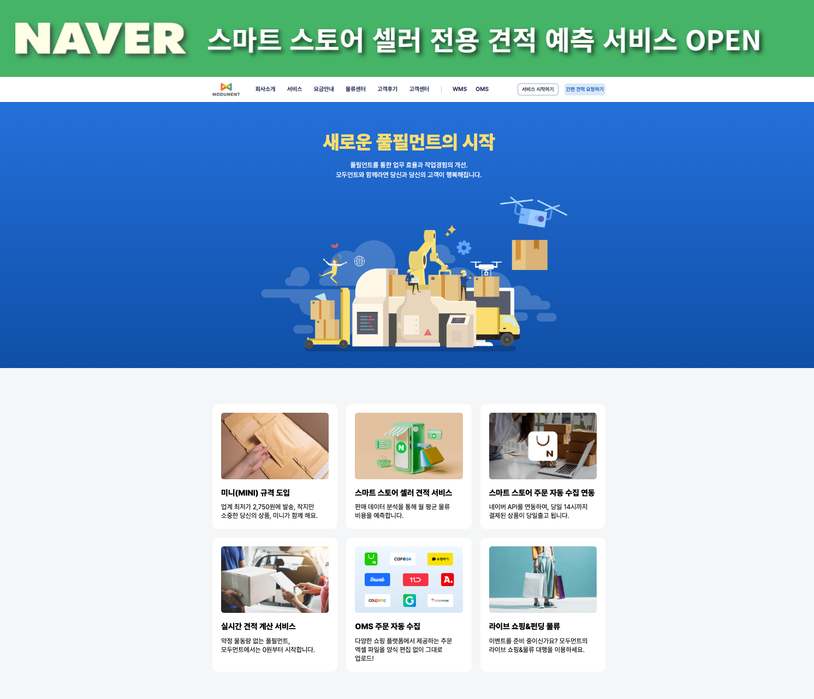
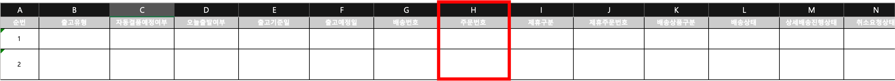
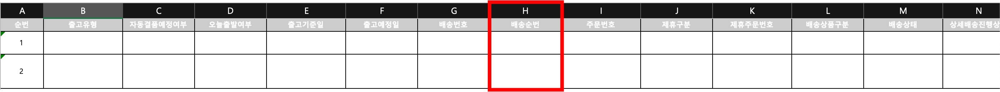
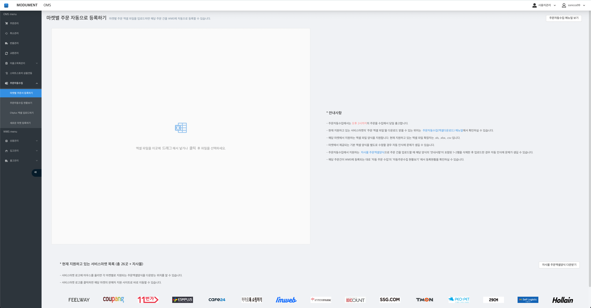
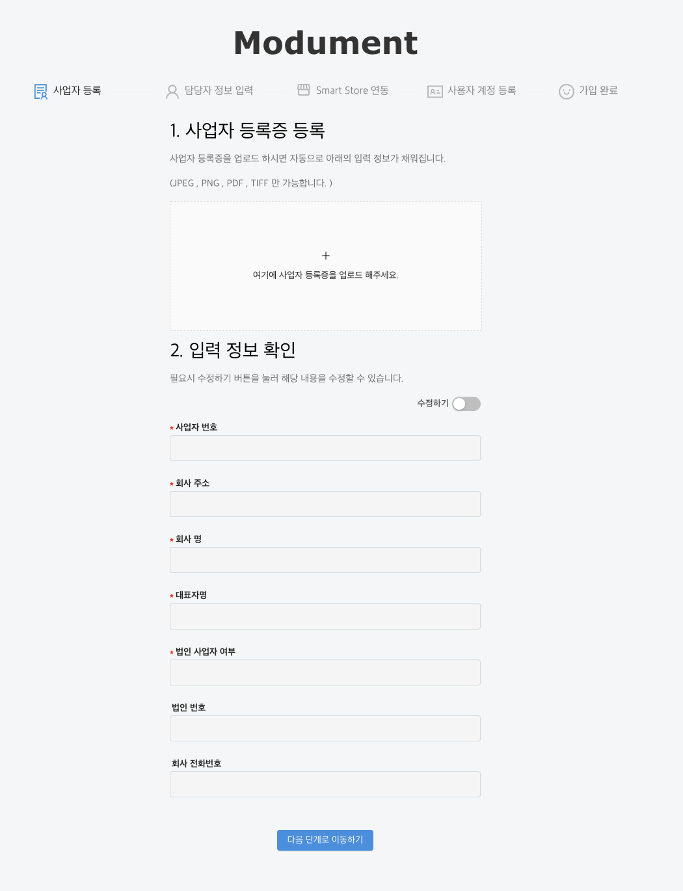
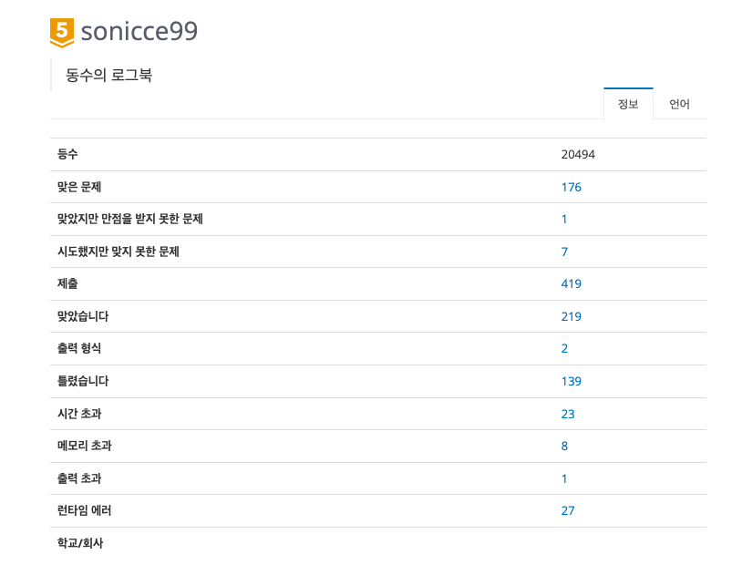
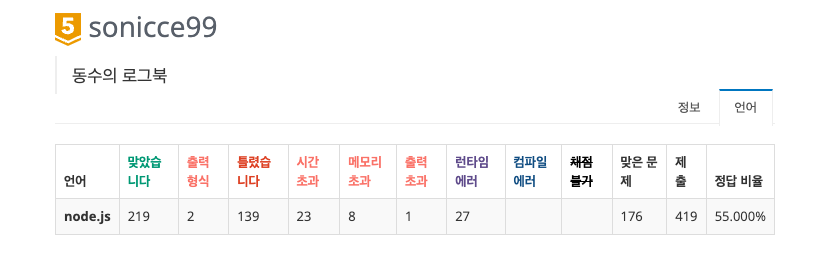
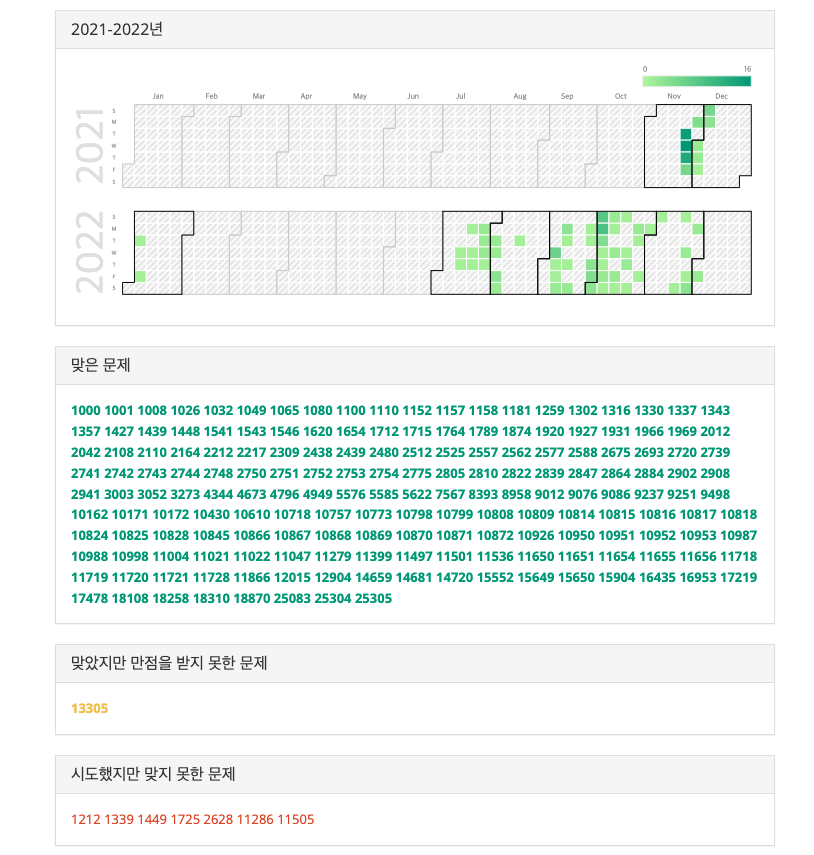

# 풀필먼트 물류를 배우다.

## 들어가기에 앞서



> 열심이였던 지난 1년.

기대 반 걱정 반으로 회사에 입사한지 거진 1년이 지났다. 이제 1년 밖에 안되었지만 많은 프로젝트를 진행했다.

처음엔 회사에서 사용하는 개발 환경에 대해 새로 공부해야할 내용들도 많았고 (Next.js, Ant-Design, Redux-toolkit, RTK-Query, sheet.js ... 등등)

이것들을 공부하면서 동시에 회사에서 요구하는 사항들을 훌륭하게 수행해야 했다.

정말 빠르게 1년이라는 시간이 흘러갔고, 공부할 수 있었던 것도 많았던 1년이였다.

## 회사 프로젝트

### 1. 홈페이지 개편



회사에 입사하고 가장 처음에 했었던 프로젝트였다.

필자가 입사하기 전 외주를 주고 웹 퍼블리셔 분들에게 작업을 맡겼다고 했었는데 내가 들어오고나서 일부 기능들이 정상적으로 동작하지 않는걸 나중에 발견했다.

(ex. 특정 메뉴를 여러번 빠르게 클릭 시 (초당 2 ~ 3회) 일부 컴퓨터에서 메뉴가 사라지는 버그가 있었음.)

그래서 버그의 제거하고자 외주 받아온 코드를 가지고 내가 다시 작업하게 되었었는데 이때 내가 느꼈던 문제점? 들은 다음과 같다.

1. 순수 html, css , JQuery로 작성이 되어 있음.

> 개발 퍼포먼스, UI 모듈화가 너무 좋지 않았다. 반복되는 내용 (header, footer menuBar 등등 ...)이 매 페이지마다 전부 복.붙 하여 코드가 작성되어 있었고, JQuery에 대해서는 제대로 알지 못했었기 떄문에 오류의 원인을 파악하기가 어려웠다.

2. html 파일명이 어느 페이지를 지칭하는지 전혀 알 수 없었다.

> 파일명이 sub1.html, sub2_2_2.html ... 등등 파일명 뿐만 아니라 변수명 조차 a 로 적어두는 등 퍼블리셔 분이 무엇을 의도하면서 작성한건지 전혀 알 수 없었다.

차라리 처음부터 만들었다면 훨씬 더 구조적으로 명확한 구조를 가지게 만들었을 수 있을거 같았지만 어찌됬던지 주어진 환경? (코드) 에서 수정을 해야했기에 다음과 같이 문제를 해결하기로 했다.

1. JQuery 에서 Vanila javascript로 일부 가능할 부분들 migration.

2. 반복되는 코드를 최대한 지우고 js로 모듈화.

   - 매 페이지마다 반복되는 review slider, pagination, banner, footer 등등 전부 삭제후 js로 분리. index.html에서 type='module'로 import.

   아래는 모듈화 한 pagination 코드이다.

   ex) ↓ pagination 코드 예시

   ```javascript
   let template = `
       <span class="prev">
           <a href="#${word}/page/{{__prev__}}">
               이전
           </a>
       </span>
       <ol>
       {{ li }}
       </ol>
       <span class="next">
           <a href="#${word}/page/{{__next__}}">
           다음
           </a>
       </span>
       `

   template = template.replace("{{ li }}", array.join(""))
   ```

   다행히 과거에 [김민태의 프론트엔드 아카데미 : 제 1강 Javascript & Typescript Essential](https://fastcampus.co.kr/dev_academy_kmt1) 강의에서 Vanila Javascript를 가지고 어떤식으로 효과적으로 작성하는지 공부를 해두었기 때문에 나름 만족스럽게 할 수 있었다.

   메뉴가 사라지는 버그의 원인은 정확하게 알 수는 없었지만 잘 알지 못하는 JQuery를 javascript로 migration 하면서 해당 버그는 사라지게 되었다.

   이번 프로젝트를 하면서 React가 얼마나 편리한지, Next.js 등등 우리가 지금 사용하는 이 방식이 얼마나 편리한지 정말 많이 느낄 수 있었던 홈페이지 개편이였다. 👍🏻 👍🏻

### 2. OMS 주문 엑셀 업로드 방식 변경

회사에는 OMS(Order Management System)가 있다.

OMS는 seller들이 입고 요청, 출고요청, 재고관리, 주문관리 등등 을 할 수 있는 곳인데

각 쇼핑몰 (Coupang, CAFE24, IMWEB ... (Naver는 자동연동))에서 다운로드 받은 주문 Excel을 OMS에 업로드 할 수 있다.

모두먼트의 경우 모두먼트만의 출고 자사몰 양식이 있지만, 각 쇼핑몰의 주문 엑셀 양식도 별다른 수정 없이 우리 OMS에 그대로 업로드 할 수 있게 한다.

그러다 보니 엑셀과 관련된 고객사 이슈가 하루에 2 ~ 3건씩 채널톡에 빈번했는데

보통은 아래의 2가지다.

- 주문 엑셀 업로드했는데 지원하지 않는 쇼핑몰이라고 떠요.

- 주문이 서버로 전송이 안돼요.

그러다 어느날 문제가 터졌다.

SSG에서 seller들에게 제공하는 엑셀 양식이 변경된것이였다.

↓ 구버전 SSG 엑셀 양식.



↓ 신버전 SSG 엑셀 양식.



신버전 양식의 H열에 '배송순번' 이라는 필드가 추가되면서 그 뒤로 전부 한칸식 밀리게 되었다. 😭

(위의 엑셀 파일을 아래에 우리 시스템에 업로드를 해줘야 주문이 반영된다.)



기존의 코드에서는 엑셀을 읽기 위해 A열에 '순번', B열에 '출고유형' 등 column의 위치에 종속되어 있어 해당 workSheet를 읽기 위해서는 쇼핑몰 별로 반드시 그 열의 위치에 값( 순번, 출고유형 등 )이 존재해야했다.

지금 모두먼트에서 지원하고 있는 온라인 쇼핑몰은 총 28곳 이고 (대표적으로 Coupang, CAFE24, IMWEB, SSG, 오늘의 집 등등 이 있다.) 앞으로 지원하는 마켓은 더더욱 늘어날 것이다.

하지만 그때마다 각각의 쇼핑몰에서 어느날 갑자기 주문 엑셀 column의 위치를 바꿔버리면 해당 쇼핑몰에서 물류사로 모두먼트를 이용하는 모든 사용자에게 서비스 장애가 일어날 것이고 이는 반드시 해결하고 넘어가야하는 문제가 되었다.

그래서 이 문제를 필자가 담당하게 되었고 더이상 엑셀의 Header field가 column의 위치에 종속 받지 않도록 프로세스를 개발하는 방식으로 업로드 방식을 변경하도록 했다.

이번에 이 프로젝트를 하면서 엑셀을 읽어오는 방식을 변경한 것도 물론 있지만 최대한 공들인 부분은 `기존의 legacy를 최대한 줄이고 꼭 필요한 부분만 모듈화 시켜서 코드를 분리하는 것`이였다.

필자가 처음 회사에 입사하고 나서 코드를 보았을 때에는 하나의 function, useEffect에서 무분별하게 사용된 setState와 Props drilling, 그리고 추상화 되지 않는 여러가지의 동작을 하나의 함수, useEffect에서 모두 처리하고 있었다.

(이걸 만든 주니어 개발자는 퇴사했다. 🥲)

그래서 함수들이 길이가 너무너무 길었고 새로 입사한 필자는 코드를 보는데 동작을 이해하기가 너무 힘들어서 이걸 최대한 분리시켜야 겠다고 생각했었다.

분리 & refactoring 한 코드들의 일부 내용은 다음과 같다.

- 업로드 된 엑셀 file을 가지고 workSheet를 읽어오는 함수. (reader.readAsBinaryString(file) 이용)

- 읽어온 workSheet가 어떤 쇼핑몰의 엑셀 파일인지 판별하는 함수.

- 읽어온 workSheet를 서버에서 원하는 JSON format으로 변경하는 함수.

- 읽어온 JSON을 재귀적으로 파고 들어가 모든 string을 trim하는 함수.

원래는 위에 이 동작들이 모두 하나의 함수에서 동작하는 함수였다. 가독성도 너무 좋지 않았고 반복적인 내용을 봍\*붙을 하는 등 가독성과 확장성이 너무 떨어졌다고 생각한다.

엑셀과 관련된 작업들 뿐만 아니라 정말 많은 부분에서 `하나의 함수가 하나의 기능과 동작만 가지도록`, 그리고 `의도한 정확한 동작을 하도록` 필자가 할 수 있는 최선을 다해 모듈화 하기 위해 시간을 들였다.

이 글을 쓰는 현재 다행히 엑셀과 업로드 관련해서 고객들의 채널톡 claim을 정말 많이 줄일 수 있었다.
**엑셀 업로드 관련 이슈 하루 평균 2 ~ 3건 -> 2, 3주에 1건 정도로 감소**

이 작업을 하면서 필자가 가장 우려했던 부분은 테스트 코드가 없다는 점이였다. 지금의 프로젝트에는 테스트 코드가 없다.

회사가 아직 작은 스타트업이니 충분히 혼자 검토해보고 코드를 지울 수 있었지만 만약 카카오같은 큰 기업이라면? 코드 잘못지워서 알지 못했던 다른 곳에서 서비스 장애가 일어난다면?

생각만 해도 끔직하다. 😂

그래서 퇴사한 개발자가 작성한 코드를 지우면서 정말 확실히 지워도 되는 부분인지 정확하게 파악하기 위해서 정말 많은 시간을 코드를 보고 분석했다.

이 작업을 계기로 테스트 코드의 필요성을 여실히 느낄 수 있었다. [여기](https://sonicce99.github.io/jest/)에 Jest 공식문서를 보고 공부한 내용들을 정리했고 추후에 테스트코드에 대해서 배우고 싶다.

### 3. OMS validation 개발

기존의 OMS의 Front단에는 validation이 없었다.

그러다 보니 seller들은 주소를 적어야하는 란에 우편번호를 적거나, 받는 사람 이름을 적어야하는 란에 주소를 적어서 업로드 하거나 하는 문제가 적지 않게 일어났다.

당연히 출고상에 문제가 생기고 고객사에서는 송장번호가 안나왔다거나, 미출고목록에서 주문관리로 넘어가지 않는다는 내용으로 채널톡에 문의가 왔다.

이런 문제를 없애고자 validation을 넣어야겠다고 생각했고 바로 진행했다.

작은 스타트업의 장점은 문제점을 인식하고 빠르게 소통하고 작업할 수 있다는 점인것 같다.

npm package로는 [class-validator](https://www.npmjs.com/package/class-validator)를 선택했는데 선택한 이유는 다음과 같다.

- Weekly Downloads가 150만 정도 되어 적지 않다.

- Usage에 적혀있는 사용방법이 직관적이고 간단하다.

- 서버쪽에서도 해당 패키지를 사용하고 있어, 모르는 사항을 물어볼 수 있다.

사용 방법을 소개하자면 다음과 같다.

```javascript
// validationCheck.ts

  // 우편번호 예시. (구 우편번호, 신 우편번호가 있음)
  @IsOptional()
  @Matches(/(^[0-9]{3}-[0-9]{3}$|^[0-9]{5}$)/, {
    message: '유효한 우편번호는 5자리 숫자 이거나 XXX-XXX 형식입니다.\n',
  })
  ZipCode: string;

  // 수량 예시.
  @IsOptional()
  @IsNumber({}, { message: '$value을 적는 열에는 숫자만 입력 가능합니다.\n' })
  Quantity: number;

  // validation 객체 생성.
  let uploadRequest = new uploadRequest();

  post.ZipCode = '12345';
  post.Quantity = 1;

  validate(post).then(errors => {
    // errors is an array of validation errors
    if (errors.length > 0) {
      console.log('validation failed. errors: ', errors);
    } else {
      console.log('전송가능');
    }
  });
```

사용법은 간단하지만 OMS에 적용하기엔 많은 어려움이 있었는데 2가지만 적어보자면 다음이 있었다.

1. 각 쇼핑몰마다 엑셀 양식이 모두 다르다. 예를 들어 주소의 경우

- 쿠팡은 "수취인 주소"

- CAFE24는 "주소"

- SSG는 "수취인지번주소" 라고 부른다.

seller가 어느 쇼핑몰의 엑셀을 업로드 할지 모르기 때문에 엑셀 업로드 시 서버에서 가지고 있는 해당 쇼핑몰의 property와 엑셀을 매핑시켜주는 작업을 했다.

```JSON
// 서버에 매핑된 쿠팡 엑셀 양식.
{
  BaseAddress: 수취인 주소,
  ZipCode: 우편번호
}
```

```JSON
// 읽어온 seller의 엑셀 worksheet.
[{
  '수취인 주소': "서울특별시 강남구 압구정로 153, 999-9999호",
  우편번호: 99999
}]
```

```JSON
// validation전 같이 최종 조합.
const uploadedExcelData = [
  {
    BaseAddress: "서울특별시 강남구 압구정로 153, 999-9999호",
    ZipCode: "99999",
  },
]
```

(블로그에 동작을 전부 보여주고 싶지만 회사에서 로그인한 고객만 사용하는 OMS라 UI를 블로그에 공개하기 어려운 점이 아쉽다 ㅠ)

2. 엑셀 파일마다 날짜나 숫자를 읽어오는 자료형이 다르다.

예를 들어 2022.12.08 12:00:00 PM 의 경우

- number로 읽어온 경우 : 44904

- string로 읽어온 경우 : '2022.12.08 12:00:00'

처음엔 날짜를 숫자로 읽어오는 저 4XXXX가 뭘까에 대해서 정말 고민을 많이했는데 알고보니 1900.01.01을 1로 잡고 1900.01.02는 2 ... 이런 식으로 늘어난 것이였다.

엑셀마다 읽어오는 자료형이 다른 경우는 [parse_date_code](https://github.com/SheetJS/sheetjs/tree/master/packages/ssf#other-utilities)로 해결했다.

```javascript
import XLSX from "xlsx"

const makeDateString = value => {
  if (typeof value === "number") {
    const timeObj = XLSX.SSF.parse_date_code(value)

    if (timeObj) {
      const { y, m, d, H, M, S } = timeObj
      const dateString = `${y}-${String(m).padStart(2, "0")}-${String(
        d
      ).padStart(2, "0")} ${H > 0 ? `${H}:` : ""}${M > 0 ? `${M}` : ""}`
      return dateString.trim()
    }
  } else {
    return value
  }
}
```

이렇게 입고, 출고, CNPlus, 등 엑셀 업로드를 사용하는 모든 부분에 validation을 적용했고 현재는 채널톡에 올라오는 OMS에 이슈가 2배 이상 감소했다.

### 4. 회원가입 프로세스 리뉴얼

[모두먼트 회원가입 프로세스](https://oms.modument.co.kr/oms/signUp)를 리뉴얼 하기로 했다.

신규로 추가하게된 프로세스(사업자 등록증, 세금계산서 관련 로직 추가)가 있기 때문이였다.

우선 기술이사님의 요구 사항은 다음과 같았다.

- 사업자 등록증을 업로드 하고 내려온 정보들 사용자에게 보여줄것. (수정도 가능하게 할 것.)

- ~~사업자 등록증이 없는 고객일 경우, 사업자 번호 대신 주민등록 번호를 입력 받게 할 것.~~

  - ( 이는 나중에 회사 정책상 사업자 등록증이 없는 고객은 안받기로 결정되어 사라짐. )

- 담당자 정보, 세금계산서 정보 입력받을것.

  - (세금 계산서 정보는 담당자 정보로 동기화 할 수 있게 할것.)

- 네이버 StmartStore, CAFE24 연동 데이터 포함해서 보낼것.

- 아이디, 비밀번호 입력받을 것.

↓ 고심 끝에 개발한 UI.



↓ 프로세스 전 과정

> step1 : 사업자 번호, 회사 주소, 회사 명, 대표자 명, 법인사업자 여부, 법인 번호, 회사 전화번호.
>
> srep2 : 담당자 이름, 담당자 전화번호, 부서 및 직책, 담당자 이메일, 세금계산서 메일주소, 세금 계산서 전화번호.
>
> step3 : 쇼팡몰 연동.
>
> step4 : 아이디, 비밀번호, 비밀번호 재확인.
>
> step5 : 가입완료

이렇게 요구사항만 만족한 형태로 UI, UX에 대한 고려는 모두 나의 능력껏 해야했었다.

회원가입을 맡게 되면서 고민했던 내용은 아래와 같다.

1. UI와 UX를 어떤 형태로 할 것인가.

- 디자인

  - 어떤 디자인이 가장 모두먼트스러울까?

- 사업자 등록증

  - 사업자 등록증을 업로드 하고 고객에게 입력 정보를 보여줄 수 있는 가장 좋은 방법은 무엇일까?

  - 사업자 등록증을 업로드 할때의 로딩 화면은 어떻게 보여줘야 할까?

- 구조

  - 어떤 구조로 잡아야 가장 직관적이고 가독성, 확장성이 좋을까?

  - 한 곳의 validation 패턴으로 전체를 관리하려면 어떻게 해야할까?

    - 각각의 Input에서 validation을 정하지 말고 모든 validation을 한번에, 하나의 함수에서 처리 할 수는 없을까?

### 5. 마이페이지 구조 개선

위에서도 언급되었지만 회사에 와서 가장 힘들었던 점이 구조화되지 않은 프로젝트였다.

Ducks Pattern 이라기엔 코드가 너무 길고 반복되어진 코드들이 많았다.

물론 회원가입 절차에서 사업자 등록증과 세금 계산서 관련 정보들이 추가되면서 마이페이지에서도 Form을 추가 해야했었지만

반복되는 validation 검사 로직과 그리고 여러 state들의 불필요한 상태관리 때문에 몇몇 버그들이 있었고,

이곳 저곳에서 사용되어 개발자가 동작을 이해할 수 없었던 여러 GloblaStyle 내부의 css,

분리되지 않은 코드들로 인해 확장성, 가독성이 좋지 못했다.

그래서 구조를 잡기 위해 아래와 같이 기능별로 여러 Tab으로 나눠서 코드를 분산시켰다.

- 회사 정보

- 담당자 정보

- 서비스 마켓 연동

- 비밀번호 변경


이렇게 구조를 나눠 필요한 부분에서 필요한 만큼만 update 칠 수 있게 작성했다.

그 결과 디버깅을 하기 쉬워졌고 UI 자체가 훨씬 직관적으로 사용성이 좋아졌다고 생각한다.

작성 예시를 보면 다음과 같다.

```javascript
// myInfoTabs.tsx
const Components = {
  "회사 정보": CompanyInfo,
  "담당자 정보": ManagerInfo,
  "서비스 마켓": ServiceMarketInfo,
  "비밀번호 변경": PasswordChange,
}

const items = useMemo(
  () =>
    Object.keys(Components).map((tabsTitle, index) => {
      const TargetComponent = Components[tabsTitle]
      return {
        label: <TabTitleStyle>{tabsTitle}</TabTitleStyle>,
        key: `${index}`,
        children: <TargetComponent myInfo={myInfo} />,
      }
    }),
  [myInfo]
)

return <Tabs centered items={items} />
```

### 6. OMS 시스템 구조 변경 (AppLayout)

회사에 입사하고 Next.js에 대해 본격적으로 공부하기 시작했다.

Next.js 공식문서를 읽으면서 [Github](https://github.com/sonicce99/TIL/blob/main/Framework_Library/Next/Next.md)에 내용을 정리해가며 공부했고, [Next.js 블로그](https://sonicce99.github.io/next/)에 완전히 내용을 다시 정리했다.

SSG, SSR 그리고 CSR과의 Hydration을 어떻게 할 수 있는지에 대해서도 알아가기 시작했다.

이때 pages 폴더에 \_app, \_document에 대해서도 공부했는데 회사 코드에는 해당 컴포넌트가 존재하지 않았다.

그래서 프로젝트 전체에 공통으로 필요한 useEffect와 같은 javascript 코드들이 어디 작성되어 있는지 찾아보니, (ex. 매 페이지마다 localStorage에 pathname을 set 하는 useEffect, 프로그래스 바 등등) 매 페이지마다 복\* 붙 되어 있었다. 😂

👉🏻 \_app.js는 최초 실행되며 모든 페이지에서 동작하는 공통 레이아웃 역할인데 이에 대한 코드가 없어서 정리가 필요하다고 생각했다.

```javascript
// _app.js

<AppLayout>
  <Component {...pageProps} />
</AppLayout>
```

- 최초로 실행되는 것은 \_app.tsx 실행.

  - 내부에 컴포넌트가 있다면 전부 실행하고 html의 body로 구성

  - Component, pageProps를 받습니다.

- \_document.tsx 실행.

  - 공통적으로 활용할 \<head> (Ex. 메타 태그)나 \<body> 태그 안에 들어갈 내용들을 커스텀할때 활용.

그래서 AppLayOut이 Component를 감싸고 있는 \_app.tsx 파일을 만들고 공통적으로 동작하는 코드들을 전부 삭제 후 AppLayOut에서 동작하도록 구조를 개선했다.

결과적으로 반복적인 코드를 지우게 되면서 가독성 및 구조적으로 많이 개선할 수 있었다.

## 개인 프로젝트

개발과 관련된 활동을 계속 해보자 생각해서 하고 있던게 적어보니 4개 정도 되는 것 같다.

### 7. nextjs-css-storybook

nextjs-css-storybook는 **어떠한 외부 css library 없이** 오직 styled-component 만으로 자연스러운 인터렉션 구현을 목표로 한다.

> [nextjs-css-storybook 보러가기](https://nextjs-css-storybook.vercel.app/?path=/story/dongsu-introduction--page)

프로젝트 구성은 다음과 같은데 주요한 특징으로는 `next.js`, `typescript`, `styled-component` 를 사용했다.

아래는 package.json 이다.

```JSON
// package.json
{
  "dependencies": {
    "next": "12.3.1",
    "react": "18.2.0",
    "react-dom": "18.2.0",
    "react-icons": "^4.6.0",
    "styled-components": "^5.3.6"
  },
  "devDependencies": {
    "@babel/core": "^7.19.3",
    "@storybook/addon-actions": "^6.5.12",
    "@storybook/addon-essentials": "^6.5.12",
    "@storybook/addon-interactions": "^6.5.12",
    "@storybook/addon-links": "^6.5.12",
    "@storybook/builder-webpack5": "^6.5.12",
    "@storybook/manager-webpack5": "^6.5.12",
    "@storybook/react": "^6.5.13",
    "@storybook/testing-library": "^0.0.13",
    "@types/react": "18.0.24",
    "@types/styled-components": "^5.1.26",
    "babel-loader": "^8.2.5",
    "eslint": "8.24.0",
    "eslint-config-next": "12.3.1",
    "eslint-plugin-storybook": "^0.6.4",
    "storybook-addon-next": "^1.6.9",
    "typescript": "^4.8.4"
  }
}
```

사실 storybook을 사용함에 있어서 SSG, SSR를 사용할 필요가 없기 떄문에 굳이 Next.js를 사용할 필요는 없었다. 하지만 회사에서 Next.js와 typescript를 사용하고 있었기 때문에 해당 프레임워크와 라이브러리를 더 공부하기 위해 사용했다.

필자는 현재 회사에서 [And-Design](https://ant.design/)을 사용하고 있어 여러 컴포넌트 (Modal, Select, TimePicker등) UI를 편리하게 사용하고 있다.

하지만 스스로 구현해보자는 생각에 [Drawer](https://nextjs-css-storybook.vercel.app/?path=/story/dongsu-drawer--default)나 [Dropdown](https://nextjs-css-storybook.vercel.app/?path=/story/dongsu-dropdown--default) 를 만들어보게 되었다.

얼마전에는 2022 월드컵을 맞아 [태극기](https://nextjs-css-storybook.vercel.app/?path=/story/dongsu-south-korea--default)를 구현해보았다. control에서 width를 조절하면 비율에 맞게 태극기의 사이즈가 조정된다.

아직은 구현한 UI가 몇 개 없지만 꾸준히 채워서 나중에는 [three.js](https://threejs.org/)를 통해 더 복잡한 3차원 이미지도 구현해보고 싶다.

### 8. 블로그 활동 (gatsby)

지금 이 블로그를 [gatsby starter blog](https://www.gatsbyjs.com/starters/gatsbyjs/gatsby-starter-blog)로 운영하다 보니 어느 순간 내가 Gatsby에 대해 알고 있나? 라는 생각이 들었다.

이 생각을 하게 된 계기가 있는데 바로 지금 보고 있는 글 옆에있는 목차를 만들어 보고자 할 때 였다.

TOC를 만들어 보고자 구글에서 gatsby에서 목차 만드는 방법을 여럿 검색해봤는데 이해가 되지 않았다.

graphql에 대한 이해도 없었고, gatsby의 동작 방식도 하나도 알지 못했으니 사실 이해가 안되는게 지금와서 생각해보면 당연하다고 생각된다.

그래서 gatsby의 튜토리얼을 읽어보며 공부했고 gatsby가 얼마나 확장성과 유연성이 좋은지 알게 되었다.

> [graphQl concepts](https://www.gatsbyjs.com/docs/conceptual/graphql-concepts/)

> [github learn-gatsby repo](https://github.com/sonicce99/learn-gatsby)

gatsby는 회사에서 사용하지 않고, 오로지 필자의 블로그 활동에서만 gatsby를 사용하고 있다보니, Next.js 만큼 익숙하지도 않고 모르는 부분이 많지만 앞으로 블로그를 더 업그레이드 시키기 위해서는 또 부딪히는 부분이 있을 것 같다.

### 9. 전문가를 위한 C

회사에서 어느날 [조수관 기술이사님](https://www.linkedin.com/in/%EC%88%98%EA%B4%80-%EC%A1%B0-0b1b37ba/) 이 책을 추천해 주셨다.

> [전문가를 위한 C](https://www.aladin.co.kr/shop/wproduct.aspx?ItemId=302576411&start=slayer)


C를 알지 못하면 결국엔 한계에 부딪힌다고 하시는 말씀을 듣고 바로 책을 구입했다.

하루에 매일 15쪽씩 읽으려고 해서 현재는 5장의 스택과 힙까지 읽었는데 1 ~ 2장까진 읽을만 한데? 라고 생각했는데 읽으면 읽을 수록 점점 이해가 쉽지는 않다. 😂

필자가 읽은 5장까지의 목차와 대략적인 요약은 아래와 같다.

- 1장. 필수 요소

  - 전처리기 지시자, 함수, 포인터

- 2장. 소스코드에서 이진 파일로

  - 컴파일의 과정 (전처리, 컴파일, 어셈블리, 링크)

- 3장. 목적 파일

  - 재배치 가능한 목적파일, 실행가능한 목적파일, 정적 | 동적 라이브러리

- 4장. 프로세스 메모리 구조

  - 정적 | 동적 메모리 레이아웃과 세그먼트 (BSS, DATA, TEXT, STACK, HEAP)

- 5장. 스택과 힙

개발자가 작성한 코드가 어떻게 빌드의 되고, 컴파일은 어떤 단계로 나누어지고 어떤 과정을 통해서 최종 프로세스를 완성시키는지에 대해서 필자같은 초보자가 읽어도 이해가 될 수 있게 아주 쉽게 적어둔 책이라는 것을 느꼈다.

물론 이 책의 두께가 무려 912 페이지에 달하지만 컴퓨터의 모든 것을 담을 수는 없기에 완전 세세하진 않지만 폭넓게 이해할 수 있는 정도로는 충분한 책인 것 같다.

꾸준히 읽어서 3번은 반복해서 읽어야할듯 하다.

### 10. 백준 Online Judge

처음 백준 문제를 푼 날이 2021.11.23일이다.



> 2022.12.05일 현재 176문제를 푼 모습





코딩테스트를 쳐서 신입으로 대기업을 들어갈 생각은 없다.

이직을 할 때 필요할 수도 것이 코딩테스트이긴 하지만 그런 의미보다

백준에서 문제 푸는것이 재미있어서 풀고있다.

~~티어 올려서 다이아 드가자\~~~

비록 2022년 7월 중순부터 제대로 풀기 시작했지만 주말 오전 시간이나 시간이 남는 틈틈히 문제를 풀었다.

> [github TIL/coding-test repo](https://github.com/sonicce99/TIL/tree/main/coding_test)

처음엔 그리디를 먼저 풀었고, 문자열, 정렬, 자료구조, 완전탐색, 이분탐색, heap, Lis, DFS, 세그먼트 트리 등등을 풀었다.

최근엔 DP를 풀어보고 있는데 참 쉽지가 않다. 😂

(잘하고 싶은데 쉽지 않는 느낌... 🥲)

문제를 보면 알고리즘 분류에 여러 알고리즘이 같이 있는 경우가 많은데 문제를 많이 풀어보지 않은 현재로서는 어떤 알고리즘이 있고 어떤 내용인지를 우선 폭 넗게 알고 있는게 좋을 것 같다는 생각이 든다.

그래서 시간 날떄마다 틈틈히 해서 한 알고리즘 당 20 ~ 40 문제씩 풀어보고자 한다.

그래도 골드 5를 찍어서 뿌듯하다.

## 아쉬웠던 점, 앞으로 하고 싶은 것들

- 대외활동

- 개발 동아리

IT 컨퍼런스나 개발 동아리를 통해서 다양한 사람들과 소통하고 정보를 공유하고 싶은데 올해는 그러지 못했다. 입사 초반에는 회사에 적응해야하는 문제도 있었고 이런 저런 일로 참여를 하지 못했는데 개발과 관련된 다양한 활동을 해보고 싶다.

그래도 2022년 많이 노력했고 성장한 1년이다. 체력관리도 열심히 하고 꾸준히 성장해 세상이 도움을 줄 수 있는 그런 개발자 되고 싶다.
