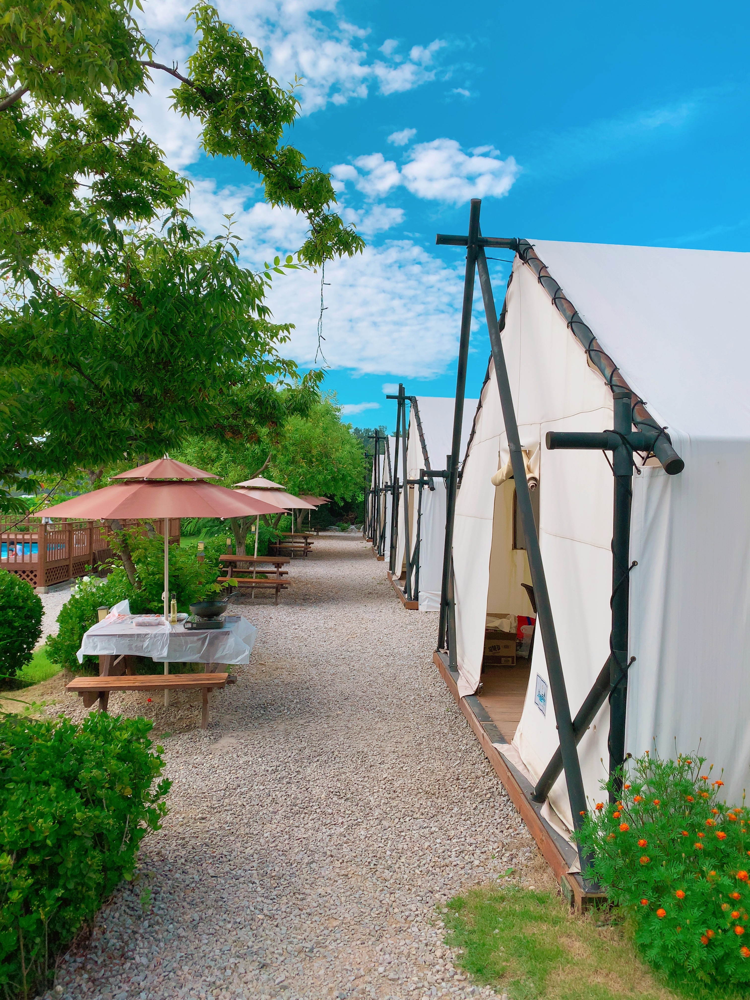
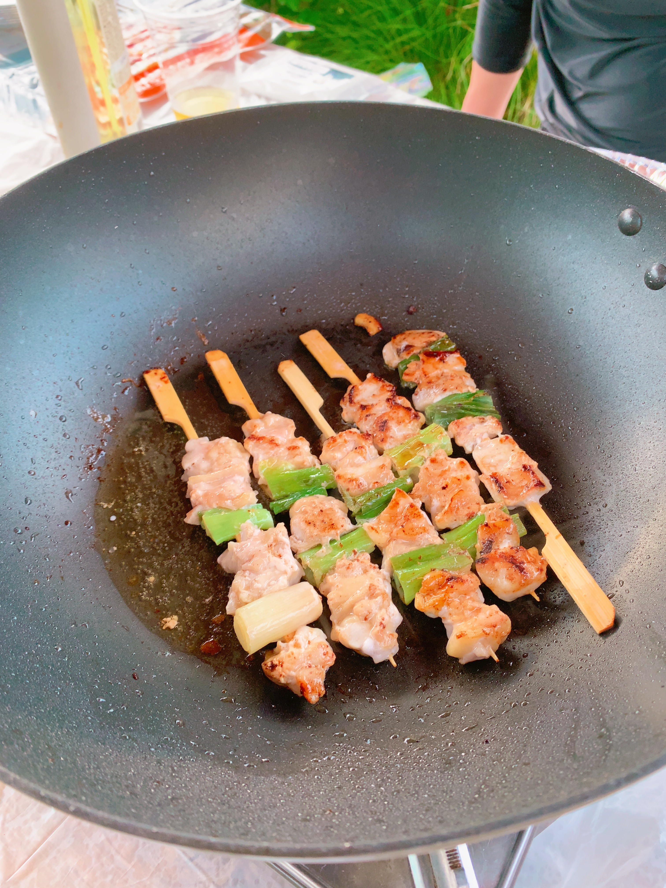
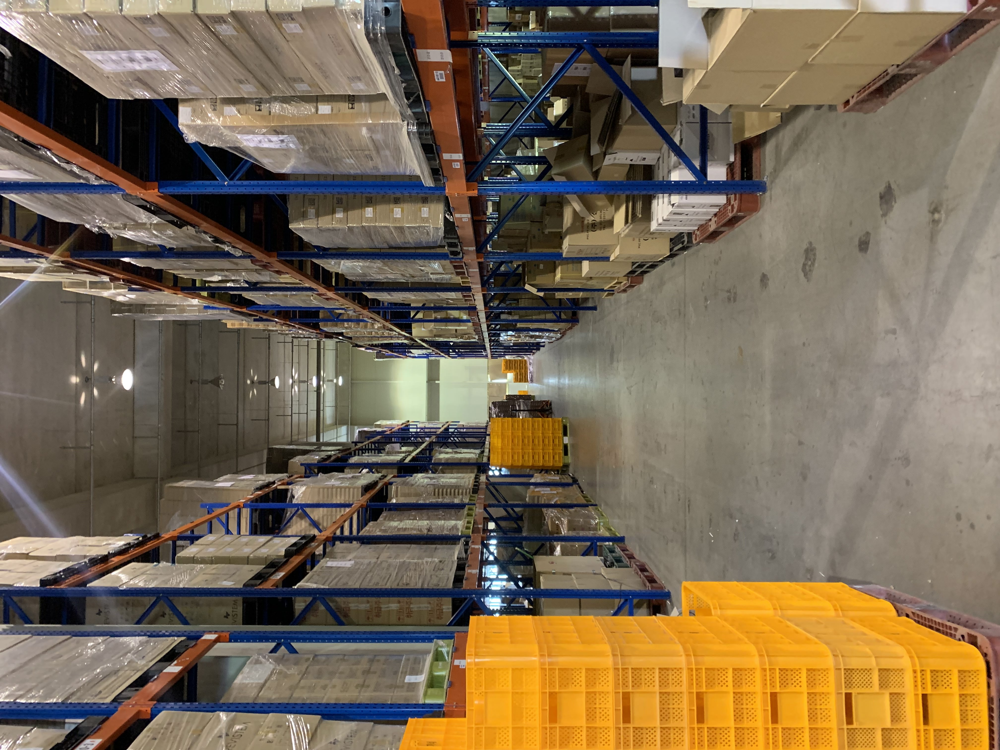

## 들어가며

2023년 7월, [캠핏](https://camfit.co.kr/)에 입사했다.

올해의 키워드를 생각해보자면 '이직, 그리고 나에게 온 새로운 기회' 라고 하고 싶다. 본격적인 이직 준비는 3월 부터 했었고, 여러 회사들과 얘기를 해본 끝에 6월에 캠핏에 합류 하기로 최종 결정을 하게 되었다. 처음 이직 준비를 하면서 많은 것들을 경험했고 어떤 회사들과 함께 해야하는지 느낄 수 있었다. 이러한 경험을 글로 정리하면서 공유해보려고 한다.

## 첫 입사지원

어떤 회사에 입사 지원을 해야하는지 막막했었다.

회사를 골라갈 수 있는 연차나 능력이 있는건 아니였지만 아무곳이나 가고 싶지 않았다. 이건 모든 분들이 같은 마음일 것이다. 나는 회사나 나 스스로나 더 성장할 수 있는 곳을 찾고 있었다.

전 직장이였던 [모두먼트](https://www.modument.com/)는 해커톤을 통해 입사하게 되었다.

[2022 Hello, Megabyte](https://github.com/sonicce99/team-saveme-FE)라는 점핏에서 주관하는 해커톤에 참여했는데 4위를 했었고 우연히 이 회사에서 나에게 면접제의를 주었다.

사람은 고작 10명 내외인 작은 스타트업이였지만 **물류 풀필먼트** 서비스를 하는 회사라는 점이 나에겐 매력적이였다.

백엔드를 설계한건 아니였지만 <u>**물류 도메인을 경험**</u>했다는 점은 나에게 많은 기회들을 주었다.

요즘 쿠팡의 로켓배송, 네이버 풀필먼트, 마켓컬리의 샛별배송과 같이 소비자에게 얼마나 빠르게 물건을 줄 수 있는냐에 대한 회사들간의 경쟁이 치열하다.

물류쪽 도메인에서 주문관리시스템 (OMS) 출고 프로세스 개선, 창고관리시스템 (WMS) 기획/개발, 네이버 스마트스토어, 쿠팡, 카페24와 같은 쇼핑몰과의 연동 경험이 있어서 일까 운 좋게도 여러 회사들과 면접을 볼 수 있었다.

캠핏 역시 한창 커머스쪽 매출을 올리기 위해 집중을 하려고 하는 시기였기에, 물류쪽 도메인에 이해도가 있는 부분을 적극 어필했고 이 부분을 잘 봐주셨던것 같다.

## 캠핑장 예약 서비스?

필자는 캠핑을 다녀본 경험이 없었다.

~~원래 집 분위기가 어디 여행을 잘 안간다~~

오토캠핑, 글램핑, 카라반, 차박, 캠프닉 등 지금에서야 이 용어들에 대해 다 알게 되었지만, 입사 초기만 해도 전부 처음듣는 용어였다.

글램핑만 한번 가본적이 있었는데 아는 형이 주도해서 몇몇 모아 인천 강화도의 [바다로 글램핑](https://search.naver.com/search.naver?where=nexearch&sm=top_hty&fbm=0&ie=utf8&query=%EB%B0%94%EB%8B%A4%EB%A1%9C+%EA%B8%80%EB%9E%A8%ED%95%91)이라는 곳을 2022년 7월말에 한번 가보았었다.

|  |  |  |
| --------------------------------------- | --------------------------------------- | --------------------------------------- |

이직을 준비하면서 여러 회사들과 면접을 봤었고 떨어진 회사도 있었지만, 최종합격이 된 회사도 몇몇 있었다.

최종합격이 된 곳을 가지않으면 다른 회사를 선택해 갈 수 있는 상황도 아니였지만 최종합격 후 남은 **마지막 하나의 의구심** 때문에 가지 못했다.

필자는 물류 풀필먼트 관련 업무를 하면서 느꼈던 1가지 갈증이 있었다.

바로 **전자상거래, 커머스**를 경험하고 싶었다.

물류 풀필먼트에서는 판매자가 우리의 고객이 된다. 즉 쿠팡에서 소비자가 물건을 구매하면 판매자가 판매된 내역을 우리(풀필먼트업체)에게 넘겨주고 우리는 해당 판매 내역을 취합하여 택배사 (CJ 대한통운 등)에 전달하고 받은 송장번호와 같은 정보를 판매자에게 전달하면 되는것이다.

그러다보니 판매자의 사용 환경을 주로 생각하게 되고, 소비자가 상품을 구매하면서 일어날 수 있는 다양한 사용자 경험을 고려할 필요가 없었다.

~~실제로 면접 본 회사 중 소비자 입장이 아니라 판매자 입장에서 얘기하는 것 같다는 피드백을 받은적도 있다.~~

필자가 경험하고 싶었던 **소비자 입장에서 일어날 수 있는 다양한 유저 경험** 은 아래와 같다.

1. 크로스브라우징 이슈

2. 결제 플로우

3. 렌더링 최적화

4. 앱 개발

합격된 회사를 가지 않았던 마지막 하나의 의구심은 내가 그동안 물류 업무를 해오면서 느꼈던 이 갈증을 과연 그 회사를 통해 해결하고 나를 이끌어 줄 수 있을까? 라는 물음표를 면접 과정에서 회사가 충족 시켜주지 못했기 때문이였다.

스스로도 어떤 회사에 가야할지 지쳐있을 무렵, 원티드에서 캠핏을 발견하고 지원했다.

캠핑 분야에 대해 잘 몰라 제대로 된 캠핑장 정보를 찾는것이 얼마나 어려운일인지 몰랐지만 하나 알고 있는게 있었다.

_캠핑 예약 서비스는 전자상거래, 커머스를 경험 할 수 있고 캠핑 시장은 앞으로 훨씬 성장할 확률이 높다는 것_

다행히 빨리 연락을 주셨고 이렇게 캠핏과의 인연이 시작되었다.

## 프로젝트

회사에 합류하고 나서 이 글을 쓰기까지 회사에서는 3번의 Iteration과 2개의 번외 프로젝트(?)가 있었다.

기존의 Sprint 단위에서 6주간의 Iteration 이라는 사이클로 바뀌면서 회사가 서서히 변화해간다고 개인적으로 느낀 1가지가 있다.

바로 회사의 모든 팀이 프로젝트에 참여해가고 있다는 점이였다.

각 조직은 각자 맞겨진, 해야할 일을 하고있을 뿐, 다른 팀이 무엇을 하고 있는지 잘 모르던 기존 방식에서, Iteration은 각 팀에서 이번 Iteration에 했으면 하는 일을 조직별로 정리하고 각 조직간에 이번 Iteration에 어떤 일을 우선할지 조율하여 합의할 수가 있다.

회사에서 비용적으로 생각하더라도 20명 기준, 월 1억 이상을 태우는데 조직간에 있어서 회사가 어떻게 돌아가는지, 다른 팀은 무엇을 하고 있는지 모른다면 참 슬픈일이다.

이런 면에서 Iteration은 지금의 캠핏에 적절한 방향인것 같다.

아래부터는 어떤 일들을 해왔는지에 대해 간단히 소개하겠습니다.

### 캠핏 로딩 개선

Iteration2에서 캠핏 로딩 개선 프로젝트를 진행했습니다.

캠핏은 하단 탭에 5개의 메뉴 (홈, 캠핑장 검색, 스토어, 캠핑생활, 마이)가 있습니다.

로딩 개선을 하게 된 이유는 아래와 같습니다.

1. 탭 전환 시마다 매번 로딩이 돌며, 로딩 시 하얀 배경이 렌더링되기 때문에 사용자 경험이 떨어질 수 있다.

2. 탭 전환 시 스켈레톤 UI가 일부 탭에만 적용되어 있어 사용자가 앱에 일관성을 느끼지 못할 수 있다.

3. 캠핑생활 탭에서만 다른 로딩 UI가 렌더링 되며, 로딩 UI가 동작 중간에 위로 살짝 shift 되는 현상 존재하여 화면이 흔들림.

4. 더이상 사용하지 않는 불필요한 패키지를 제거함으로서 사용자는 더 빨라졌다고 느낄 수 있다.

실질적인 개발기간은 약 2주 정도였고, 개선 결과는 다음과 같습니다.

- 페이지 이동 시마다 나타나는 흰 화면을 제거하고, 데이터가 없어도 화면에 보일 수 있는 부분을 우선 렌더링 하도록 변경.

- 기존의 GlobalLoading을 스켈레톤 UI로 변경.

- 불필요한 패키지 제거함으로서, script parsing 시간 감소로 인한 로딩 시간 단축.

  - FCP (First Contentful Paint) 1.1초 → 0.8초로 단축 (30% 단축)
  - TBT (Total Blocking Time) 3.3초 → 2.2초로 단축 (33% 단축)

캠핏에 합류 후 처음부터 끝까지 참여한 첫번째 프로젝트였기에 더욱 의미가 있었고, 로딩 개선을 하기 위해 캠핏의 프론트 코드가 어떻게 되어 있는지 구조 분석을 하면서 많이 배울 수 있었던 프로젝트 였습니다.

### Shopby API 순차 요청

회사에 입사했을 무렵, 회사는 NHN Commerce의 [Shopby](https://www.nhn-commerce.com/z/shopby)라는 SaaS를 통해 인앱결제 프로젝트를 하고 있었다.

자세한 내용은 [인앱결제 프로젝트 중 만난 일](https://sonicce99.github.io/shopby/)을 통해 확인할 수 있다.

70%정도 프로젝트가 진행된

### 광고배너 롤링 방식 변경 건

### 구글 애널리틱스 (GA4)

회사에서 커머스 매출을 증가시키기 위해 스토어 탭 최상단의 큐레이션을 개편하기로 했다.

이때 shopby의 기획전 기능을 사용하여 캠핏특가, 크리스마스 특가와 같은 기획전을 만들기로 결정되었는데 이때 가장 중요했던 이슈는 **여러 기획전 중 과연 어떤 기획전이 가장 유저들의 이목을 끈 유의미한 기획전인가**를 알아내는 것이였다.

그래서 GA4와 구글 태그 매니저를 통해 사용자 트래킹을 하기로 했고 GA4에 대해 공부할 수 있는 계기가 되었다.

GA4, UA 관련 책을 사서 읽기도 하고 [오픈소스마케팅](https://www.youtube.com/@osoma)이라는 유튜브를 보며 어떻게 데이터 분석을 해야하는지 살펴보기도 했다.

공부하며 좀 어려웠던 점은 비교적 최근인 2023년 7월 1일부터 15년간 있었던 구글의 UA가 지원 종료됨에 따라 GA4에 관련된 자료를 찾기가 어려웠다는 점이다.

UA와 GA4의 차이점은 페이지뷰/ 세션 기반에서 이벤트 중심으로 변경되었다는 점이다.

이에 따라 UI와 내용이 달라진 부분이 많았고 원하는 자료를 바로 찾기가 어려웠다.

구글 애널리틱스 관련된 책이 대부분이 UA관련 내용이였고 심지어 “GA4 입문” 이라고 나와있는 책에도 UA 관련 내용이 나와있는 책들도 많았다.

~~구글이 15년간 사용한 UA를 급하게 GA4로 변경한 이유로는 유럽연합(EU)의 데이터 및 개인정보 보호 관련 제제가 있었다 라는 썰을 어디선가 보았다.~~

### 네이버 연동

DB에 어떤것을 저장하는지,

## 부록

### 올해 읽은 책

이직을 준비하면서 읽은 책도 있고, 평소에 읽어보고 싶어서 읽은 책도 있다.

1. 헤드퍼스트 디자인패턴

2. 자바스크립트 디자인 패턴

3. 마이크로서비스 도입 이렇게 한다.

4. 손으로 익히며 배우는 네트워크 첫걸음

5. AWS 구조와 서비스

6. 이더리움을 활용한 블럭체인 프로젝트 구축

7. 프론트엔드 성능 최적화 가이드

// 8. 회사에서 읽은 GA 관련 책, Web 해킹 관련

<!--  -->

<!-- 

  
  
  
  
  
  <figcaption align="center">5개 이미지 띄우기</figcaption>

 -->

### 백준

|    날짜    |   등수   | 제출 | 맞은문제 |
| :--------: | :------: | :--: | :------: |
| 2022.12.05 | 20,494등 | 419  |   176    |
| 2023.01.08 | 11,908등 | 847  |   319    |

주말 오전에 나름 꾸준히 문제를 풀어서 작년 1년 동안 총 428번 제출, 143문제를 풀었다.

평일에도 틈틈히 시간 났을 때 했더라면 더 많이 풀 수 있었을 텐데 하지 못했던 것이 좀 아쉽다.

작년에는 자료구조, 문자열, 그리디, 브루트포스, 정렬과 같은 알고리즘을 위주로 다루었는데 올해 상반기에는 백트래킹, DFS, BFS 알고리즘 위주로 풀 계획을 가지고 있다.

### 물류센터

## 마무리하며

캠핏에 오며 기존에 하지 못했던 많은 것들을 할 수 있었다. 웹/앱 (React, React-Native) 개발자 포지션으로 입사했지만 node.js로 작성되어 있던 캠핏 백엔드 덕분에 백엔드를 API를 작성할 기회도 주어지고, 추가 옵션 관련해서 네이버와 API 연동도 했다. AWS Lambda가 어떻게 동작되는지, 오토스케일링의 동적조정을 어떻게 하는지, 캠지기 센터의 Angular도 다루게 되었으며, 구글 애널리틱스의 GA4, UA 관련 트리거, 태그도 작성해 데이터 기반의 의사결정을 어떻게 할 수 있는지에 대해서도 이해할 수 있었다.

회사에 입사한지 이제 7개월이지만 이 많은 것들을 경험할 수 있게 해준 회사에 감사드린다.
