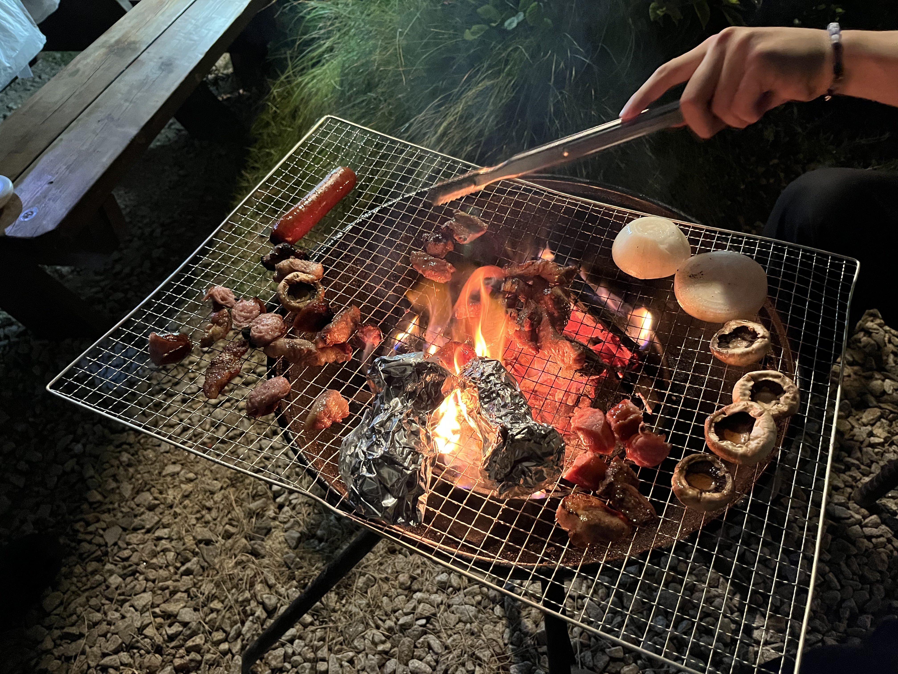

## 들어가며

2023년 7월, [캠핏](https://camfit.co.kr/)에 입사했다.

올해의 키워드를 생각해 보자면 '이직, 그리고 나에게 온 새로운 기회' 라고 하고 싶다. 본격적인 이직 준비는 3월부터 했었고, 여러 회사들과 얘기를 해본 끝에 6월에 캠핏에 합류하기로 최종 결정을 하게 되었다. 처음 이직 준비를 하면서 많은 것들을 경험했고 어떤 회사들과 함께 해야 하는지 느낄 수 있었다. 이러한 경험을 글로 정리하면서 공유해 보려고 한다.

## 입사지원

어떤 회사에 입사 지원을 해야 하는지 막막했었다.

회사를 골라갈 수 있는 연차나 능력이 있는 건 아니었지만 아무 곳이나 가고 싶지 않았다. 이건 모든 분들이 같은 마음일 것이다. 나는 회사나 나 스스로나 더 성장할 수 있는 곳을 찾고 있었다.

전 직장이였던 <a href="https://www.modument.com/" target="_blank">모두먼트</a>는 해커톤을 통해 입사하게 되었다.

<a href="https://github.com/sonicce99/team-saveme-FE" target="_blank">2022 Hello, Megabyte</a>라는 점핏에서 주관하는 해커톤에 참여했는데 4위를 했었고 우연히 이 회사에서 나에게 면접제의를 주었다.

사람은 고작 10명뿐인 작은 회사였지만 **물류 풀필먼트** 서비스를 하는 회사라는 점이 나에겐 매력적이였다.

백엔드를 설계한건 아니였지만 <u>**물류 도메인을 경험**</u>했다는 점은 나에게 많은 기회들을 주었다.

요즘 쿠팡의 로켓배송, 네이버 풀필먼트, 마켓컬리의 샛별배송과 같이 소비자에게 얼마나 빠르게 물건을 줄 수 있는 냐에 대한 회사들 간의 경쟁이 치열하다.

물류 쪽 도메인에서 주문관리 시스템 (OMS) 출고 프로세스 개선, 창고관리시스템 (WMS) 기획/개발, 네이버 스마트 스토어, 쿠팡, 카페24와 같은 쇼핑몰과의 연동 경험이 있어서 일까? 여러 회사 중 운 좋게도 개발자라면 누구나 가보고 싶어 하는 회사들과 면접을 볼 기회도 주어졌었다.

캠핏은 한창 커머스 쪽 매출을 올리기 위해 집중하는 시기였기에, 물류 쪽 도메인에 이해도가 있는 부분을 적극 어필했고 이 부분을 잘 봐주셨던 것 같다.

## 캠핑장 예약 서비스?

필자는 캠핑을 다녀본 경험이 없었다.

~~원래 집 분위기가 어디 여행을 잘 안 간다🥲~~

오토캠핑, 글램핑, 카라반, 차박, 캠프닉 등 지금에서야 이 용어들에 대해 다 알게 되었지만, 입사 초기만 해도 글램핑 제외하고 전부 처음 듣는 용어였다.

글램핑만 한번 가본 적이 있었는데 아는 형이 주도해서 몇몇 모아 인천 강화도의 **바다로글램핑** 이라는 곳을 2022년 7월 말에 한번 가본 경험이 있었다.

|  |  |  |
| --------------------------------------- | --------------------------------------- | --------------------------------------- |

<em><a href="https://search.naver.com/search.naver?where=nexearch&sm=top_hty&fbm=0&ie=utf8&query=%EB%B0%94%EB%8B%A4%EB%A1%9C+%EA%B8%80%EB%9E%A8%ED%95%91" target="_blank">바다로 글램핑</a></em>

이직을 준비하면서 여러 회사들과 면접을 봤었고 떨어진 회사도 있었지만, 처우 협의도 마무리하여 최종 합격이 된 회사도 몇 있었다.

최종 합격이 된 곳을 가지 않으면 다른 회사를 선택해 갈 수 있는 상황도 아니었지만 최종 합격 후 남은 **마지막 하나의 의구심** 때문에 결국 입사를 포기했다.

필자는 물류 풀필먼트 관련 업무를 하면서 느꼈던 1가지 갈증이 있었다.

바로 **전자상거래, 커머스**를 경험하고 싶었다.

물류 풀필먼트에서는 판매자가 우리의 고객이 된다. 즉 쿠팡에서 소비자가 물건을 구매하면 판매자가 판매된 내역을 우리(풀필먼트업체)에게 넘겨주고 우리는 해당 판매 내역을 취합하여 택배사 (CJ 대한통운 등)에 전달하고 받은 송장번호와 같은 정보를 판매자에게 전달하면 되는 것이다.

그러다 보니 판매자의 사용 환경을 주로 생각하게 되고, 소비자가 상품을 구매하면서 일어날 수 있는 다양한 사용자 경험을 고려할 필요가 없었다.

~~실제로 면접 본 회사 중 소비자 입장이 아니라 판매자 입장에서 얘기하는 것 같다는 피드백을 받은 적도 있다.~~

필자가 경험하고 싶었던 **소비자 입장에서 일어날 수 있는 다양한 유저 경험** 은 아래와 같다.

1. 크로스브라우징 이슈

2. 결제 플로우

3. 렌더링 최적화

4. 앱 개발

합격된 회사를 가지 않았던 마지막 하나의 의구심은 내가 그동안 물류 업무를 해오면서 느꼈던 이 갈증을 과연 그 회사를 통해 해결하고 나를 이끌어 줄 수 있을까? 라는 물음표를 면접 과정에서 회사가 충족 시켜주지 못했기 때문이었다.

스스로도 어떤 회사에 가야 할지 지쳐있을 무렵, 원티드에서 캠핏을 발견하고 지원했다.

캠핑 분야에 대해 잘 몰라 제대로 된 캠핑장 정보를 찾는 것이 얼마나 어려운 일인지 몰랐지만 하나 알고 있는 게 있었다.

_캠핑 예약 서비스는 전자상거래, 커머스를 경험할 수 있고 캠핑 시장은 앞으로 훨씬 성장할 확률이 높다는 것_

다행히 빨리 연락을 주셨고 이렇게 캠핏과의 인연이 시작되었다.

## 프로젝트

회사에 합류하고 나서 이 글을 쓰기까지 회사에서는 3번의 Iteration과 2개의 번외 프로젝트(?)가 있었습니다.

기존의 2 ~ 3주 Sprint 단위에서 6주간의 Iteration이라는 사이클로 바뀌면서 회사가 서서히 변화해간다고 개인적으로 느낀 1가지가 있습니다.

바로 **회사의 모든 팀이 하나의 프로젝트에 참여해가고 있다**는 점.

각 조직은 각자 맞겨진, 해야 할 일을 하고 있을 뿐, 다른 팀이 무엇을 하고 있는지 잘 모르던 기존 방식에서, Iteration은 각 팀에서 이번 Iteration에 했으면 하는 일을 조직별로 정리하고 각 조직 간에 이번 Iteration에 어떤 일을 우선할지 조율하여 합의할 수가 있습니다.

그래서 훨씬 조직적으로 변화해가고 있다는 것을 느꼈고, 캠핏은 이렇게 일하고 있습니다.  

아래부터는 2023년에 어떤 일들을 해왔는지에 대해 간단히 소개하겠습니다.

### 캠핏 로딩 개선

Iteration2에서 캠핏 로딩 개선 프로젝트를 진행했습니다.  
캠핏은 하단 탭에 5개의 메뉴 (홈, 캠핑장 검색, 스토어, 캠핑생활, 마이) 가 있습니다.

로딩 개선을 하게 된 이유는 아래와 같습니다.

1. 탭 전환 시마다 매번 로딩이 돌며, 로딩 시 하얀 배경이 렌더링 되기 때문에 사용자 경험이 떨어질 수 있다. 
2. 탭 전환 시 일부 탭에만 스켈레톤 UI가 적용되어 있어 일관된 사용자 경험을 해칠 수 있다. 
3. 캠핑생활 탭에서만 다른 로딩 UI가 렌더링 되며, 로딩 UI가 동작 중간에 위로 살짝 shift 되어 Layout이 흔들리는 현상이 존재했습니다. 
4. 더 이상 사용하지 않는 불필요한 패키지가 존재했습니다.  

실질적인 개발 기간은 약 2주 정도였고, 개선 결과는 다음과 같습니다.

- 페이지 이동 시마다 나타나는 흰 화면을 제거하고, 화면에 먼저 보일 수 있는 부분을 우선 렌더링 하도록 변경. 
- 기존의 GlobalLoading을 스켈레톤 UI로 변경. 
- 불필요한 패키지 제거함으로써, script parsing 시간 감소로 인한 로딩 시간 단축. 

  - FCP (First Contentful Paint) 1.1초 → 0.8초로 단축 (30% 단축)
  - TBT (Total Blocking Time) 3.3초 → 2.2초로 단축 (33% 단축)

캠핏에 합류 후 처음부터 끝까지 참여한 첫 번째 프로젝트였기에 더욱 의미가 있었고, 로딩 개선을 하기 위해 캠핏의 프론트 코드가 어떻게 되어 있는지 구조를 제대로 파악할 수 있었던 프로젝트였습니다.  

### Shopby API 순차 요청

<a href="https://sonicce99.github.io/shopby/" target="_blank">인앱결제 프로젝트 중 만난 일</a> 을 참조해주세요.

### 광고배너 롤링 방식 변경 건

Iteration3에서 해당 작업을 진행했습니다.  
Iteration3에서의 가장 중요한 목표는 **커머스의 매출 증가** 였고 이에 따라 **shopby 기능을 이용한 커머스 매출 증가 프로젝트** 의 일환으로 광고 배너 롤링 방식 변경 작업을 진행했습니다.

점심 먹으러 가던 도중 태훈님의 아이디어로 문제점을 인식할 수 있었고 비교적 간단히 해결하였습니다.

기존의 배너 노출 방식은 페이지 이동 시 항상 첫 번째 배너가 보이는 방식입니다. 

때문에 만약 6개의 배너가 있다면 유저에게는 항상 1 ~ 3번째 배너만 노출될 확률이 높고 뒤의 4 ~ 6번 배너는 손으로 스와이핑 하지 않는 이상 노출될 가능성은 현저히 낮을 수 있지 않을까? 라는 의문을 제게 주셨습니다. 

유저의 관심사에 따라 배너를 노출하는 방식이 아니기 때문에 4 ~ 6번째 배너 광고가 어떤 유저에게는 정말 필요했던 제품이 될 수 있을 것입니다.  

따라서 현재는 유저가 특정 탭을 이탈 후 다시 왔을 경우, 기존의 노출되었던 배너의 다음 순서의 배너를 순차적으로 보여줄 수 있도록 변경되었습니다.  

이번 프로젝트를 통해 배운 점 2가지가 있었습니다.    

- 기존에 유지되고 있는 프로세스보다 더 효율적인 방법이 없을까? 항상 고민하기

- 가설을 통해 작업을 진행했다면, 데이터를 통해 정말로 해당 작업을 통해 유의미한 결과를 이끌어냈는지 검증하기   

### 구글 애널리틱스 (GA4)

커머스 매출을 증가시키기 위해 스토어 탭 최상단의 큐레이션을 개편하기로 했습니다.  

이때 shopby의 기획전 기능을 사용하여 캠핏특가, 크리스마스 특가와 같은 기획전을 만들기로 결정되었는데 이때 가장 중요했던 이슈는 **여러 기획전 중 과연 어떤 기획전이 가장 유저들의 이목을 끈 유의미한 기획전인가**를 알아내는 것이었습니다. 

그래서 GA4와 구글 태그 매니저를 통해 사용자 트래킹을 하기로 했고 이를 그래프로 대시보드화하기로 했습니다.

GA4, UA 관련 책을 사서 읽기도 하고 <a href="https://www.youtube.com/@osoma" target="_blank">오픈 소스 마케팅</a>이라는 유튜브를 보며 어떻게 데이터 분석을 해야하는지 살펴보기도 했습니다.  

공부하며 어려웠던 점은 비교적 최근인 2023년 7월 1일부터 15년간 있었던 구글의 UA가 지원 종료됨에 따라 GA4에 관련된 자료를 찾기가 어려웠다는 점입니다.  

*(참고: UA 다음 버전이 GA4입니다.)*

UA와 GA4의 차이점은 **페이지뷰/ 세션 기반** -> **이벤트 중심**으로 변경되었다는 점입니다. 

이에 따라 UI와 내용이 달라진 부분이 많았고 원하는 자료를 바로 찾기가 어려웠습니다. 

구글 애널리틱스 관련된 책이 대부분이 UA 관련 내용이었고 심지어 “GA4 입문” 이라고 나와있는 책에도 UA 관련 내용이 나와있는 책들도 많았습니다. 

~~구글이 15년간 사용한 UA를 급하게 GA4로 변경한 이유로는 유럽연합(EU)의 데이터 및 개인정보 보호 관련 제제가 있었다는 썰을 어디선가 보았다.~~

### 파트너 연동 (네이버)

캠핏 영업팀에서는 한 가지 고민거리가 있었습니다. 

이미 많은 캠핑장이 캠핏에 입점했지만, 아직도 입점하지 않은 캠핑장들이 많다는 것입니다. 
(캠핏은 현재 가장 많은 캠핑장들을 보유한 플랫폼입니다.)

이 캠핑장들이 아직 캠핏에 입점하지 않는 이유는 무엇일까요? 

이 캠핑장들은 <a href="https://www.yanolja.com/" target="_blank">야놀자</a>, <a href="https://m.thankqcamping.com/" target="_blank">땡큐 캠핑</a>, <a href="https://www.campingtalk.me/" target="_blank">캠핑톡</a>과 같은 플랫폼에 입점해 있으며 해당 플랫폼 뿐만 아니라 플랫폼에서 제공하는 파트너(네이버)와의 연동을 통해 네이버에서도 객실 예약이 가능합니다.

캠핑장 사장님 입장에서 캠핏은 이미 100만 MAU를 내는 플랫폼이고, 많은 캠핑장들이 입점했지만 파트너 연동이 안되기 때문에 플랫폼을 변경함으로써 기존의 네이버 예약으로 들어왔던 수요 감소로 인해 오는 매출 감소 리스크를 굳이 떠않을 필요가 없는 것입니다.

따라서 캠핏에서도 네이버를 통해 예약할 수 있게 하고 이를 통해 캠핏에 입점하지 않았던 캠핑장의 영업을 강화시켜 압도적인 캠핑장 입점 차이를 벌리기 위해 파트너 연동 프로젝트를 진행했습니다.

네이버의 예약 방식은 다음과 같습니다.

1. 가고 싶은 캠핑장 날짜를 고른다.  

2. 추가 인원, 추가 차량, 반려견 동반 및 기타옵션을 선택한다.

3. 결제 및 예약 완료  

추가 옵션이 없는 경우의 예약 플로우는 백엔드팀이 담당했지만, 추가 옵션을 선택해야 하는 경우의 예약플로우는 리소스 문제로 프론트팀이 일부 백엔드 구현을 담당했습니다.

프론트팀이 작업한 옵션은 2가지 구분이 있습니다.

- 캠핏 필수 카테고리 (예약 시 필수로 선택해야하는 옵션)  

  - 추가 인원
    - 성인 인원 추가
    - 미성년 인원 추가

  - 추가 차량
    - 캠핑카
    - 트레일러
    - 렌트카

  - 반려견 추가

- 기타 옵션 (캠핑장에서 부가적으로 판매하는 물품에 대한 옵션)    

  - 바비큐
  - 마른 장작
  - 수영장
  - 등유 난로
  - 에어컨 사용 여부
  - 등등

프로젝트를 진행하면서 고려해야 할 부분들이 정말 많았습니다. 

1. 기존의 캠핏 백엔드 구조 및 예약 플로우 이해하기    
2. 어떤 옵션을 필수 카테고리로 해야 할지 논의하기
3. 캠핏은 옵션 비용을 숙박 수만큼 추가로 받는데 네이버는 특정 옵션을 숙박수 만큼 추가 계산할 수 있는 기능이 없어 네이버 UI 상에 어떻게 녹여내야 할지  
4. 네이버에서 예약 정보를 캠핏에서 예약한 것과 똑같이 예약 목록, 정산에 녹여내야 하는데 어떻게 해야 할지  
5. 네이버의 환불 정책과 캠핏의 환불 정책이 다른데 환불 시 캠지기센터 UI며, 로직이며 구현을 어떻게 해야할지 
6. 수수료 체계는 어떻게 해야할지  
등등...

네이버에서 여러 옵션을 선택해 예약하더라도 캠핏에서 예약한 것과 똑같은 예약 정보를 만들어 내기 위해서 프론트팀 모두가 몸으로 부딪혀 가며 똘똘 뭉쳐 작업했습니다.
정말 짧은 기간에 많은 회의를 하며 결정했었고 다들 열심히 으샤으샤하는 분위기 속에서 고생했지만 정말 재미있었던 프로젝트였습니다.
열심히 함께 고생해 준 팀원들에게 감사하며 이번 프로젝트를 통해 캠핏 백엔드에 대해 작은 부분이지만 예약 플로우가 어떻게 구현되어 있는지 파악할 수 있었고 네이버와 QA 및 협업을 진행하며 한층 성장할 수 있었습니다.  

## 부록

### Hi Taiwan

2023년 12월 7일 ~ 10일까지 3박 4일간 친구와 대만 여행을 다녀왔다.

이 친구와 원래 재작년에 제주도 여행을 가기로 했었다. 

그런데 이 친구가 어느 날 여자친구가 생기더니 갑자기 여자친구랑 제주도를 가야 할거 같다고 미안하다고 쌩까서(?) 못 가게 되었다.

그리고 작년에 통화 중 갑자기 일본 여행을 가자고 얘기가 되었고 그렇게 며칠 후 만나서 비행기 예매를 하기로 했다. (둘 다 P다.)

필자는 이미 도쿄와 오사카를 가본 상태였고 남은 후보지는 후쿠오카와 삿포로였다.

그런데 찾아보니 후쿠오카는 생각보다 볼거리가 별로였고 진짜 갈만하다고 생각한 건 겨울이니 삿포로밖에 없었다.

그런데 비행기 예매하기 1시간 전, 남자끼리 무슨 삿포로냐며 갑자기 대만으로 노선이 바뀌었다.
(이건 맞긴 맞다.)

대만에 다녀오고 느낀 점은 다음과 같다. 

1. 건물이 진짜 상상 이상으로 낡았다.

나중에 찾아보니 대만은 365일 중 200일 이상이 비 오고 습하다고 한다.  
건물 외벽에 돈을 들여 아무리 페인트칠을 다시 해도 곧 곰팡이가 다시 쓸 수밖에 없다고 한다.  
그래서 대만의 청담동 같은 곳을 가도 건물이 무슨 하울의 움직이는 성같이 낡아 보인다.

2. TSMC의 나라 답게 건물이 반도체(?) 스럽다.

정말 많은 건물이 반도체 낸드 238단, 321단 같이 층을 촘촘히 쌓아 올린 것 같은 건물이 많았다. 
대만이 반도체 위탁 생산에 정말 특화된 나라라는 걸 느꼈고 우리나라와 비슷한 수준의 국민성과 역사를 가졌다고 느꼈다.  
우선 역사적으로 대만은 많은 나라의 지배를 받았다. (네덜란드, 청나라, 일본, 중국)  
그래서 국민들이 독립을 하기 위해 강한 의지와 열망을 가졌고 국민 전반적으로 성실하구나 하는 게 느껴졌다. 

실제로 2일차에 대만 버스투어를 했고, 이때 대만 여성분과 결혼하신 한국 가이드분을 만났는데 평소 후기를 귀찮아서 쓰지 않는 나를 후기 쓰게 만들 정도로 성실하고 큰 에너지를 가진 분이셨다.  
(진짜 이렇게도 열심히 사실 수 있구나 눈물이 날 정도로 감동받았다.)  
버스 투어 끝나고 이분을 기억하고 싶어 사진 요청을 드렸고 같이 사진도 찍었다.

3. 외식 문화가 발달했다. 

외식문화가 발달한 이유로는 대만이 돈이 많아서가 아니다. 바로 주방이 없는 집이 많아서다.  
주방이 없다고..? 필자도 듣고 깜짝 놀랐는데, 대만의 낡은 건물들을 보면 그럴 거 같다고 수긍이 된다.  
이건 실제로 버스 투어 도중 가이드분이 말씀해 주신 내용이다.  
대만의 물가는 한국보다 2배 정도 싼 반면에 부동산 가격은 한국과 비슷한 수준이라고 한다.   

TMI1. 대만 대졸의 취업자 월평균 급여는 110만원 정도라고 한다.  
TMI2. 물가가 한국의 절반 밖에 안 한다. 친구랑 돈 50만원 쓰자고 가져갔는데 진짜 막 써도 30만원밖에 못썼다.  

그렇기 때문에 대만에서 내 집 마련이 정말 어려우며 주방이 없고 공간을 share 해서 사용하는 곳이 많다고 한다.  
요리를 해먹을 수가 없으니 외식을 하거나 시켜 먹는 문화가 발달했다고 한다. 

최근 대만의 GDP가 많이 올라갔는데 이는 TSMC 때문이라고 한다.  
TSMC 때문에 국가적으로 보기에는 잘 살아 보이지만, 실제로는 매우 빈부격차가 크며 가난한 사람들이 많다고 한다. 

<em>타이페이 101 타워</em>

### 올해 읽은 책

이직을 준비하면서 읽은 책도 있고, 평소에 읽어보고 싶어서 읽은 책도 있다.
이 중 괜찮다고 생각했던 책이 몇 권 있다.

#### 전문가를 위한 C

전 직장 CTO님이 C를 모르면 결국 한계에 부딪친다고 꼭 읽어야 한다고 해서 샀다.
사실 재작년에도 읽고 있었던 책이지만 책이 워낙에 두꺼운 탓에 두고두고 읽긴 했다. 

~~최근엔 거의 안 읽긴 했다…~~

책 이름은 전문가를 위한다는 책이지만, 읽어보면 정말 재미있게 초보자도 어렵지 않게끔 나름(?) 잘 설명해 준다. 
내용은 코드가 이진 파일로 변환되기까지의 과정 (전처리, 컴파일, 어셈블링, 링커)을 통해 하나의 실행 가능한 목적 파일이 어떻게 만들어지는지 깊게 설명해 주고, 프로세스와 스레드 메모리 구조, 스택과 힙, 컴퓨터의 역사, 동시성 때문에 생길 수 있는 공유자원에 대한 경쟁 상태와 해결 방법, IPC, 소켓 프로그래밍에 대해 나온다. 

사실 컴퓨터와 역사까지는 재미있는데 동시성 내용부터는 세마포어 어쩌구 하는데 이해하기 어렵다😂  
<a href="https://product.kyobobook.co.kr/detail/S000061898000" target="_blank">(구매링크)</a>

#### 손으로 익히며 배우는 네트워크 첫걸음

도서관에서 어떤 책을 읽어볼까 하다가 고른 책이다.  
인터넷에 찾아보니 보통 주니어 단골 면접 질문으로 다음과 같은 질문이 있다고 한다.  

**브라우저에 <a href="https://camfit.co.kr/" target="_blank">https://camfit.co.kr/</a>을 치면 일어나는 일에 대해 아는만큼 설명해주세요.**

이 책을 읽게 된다면 이런 대답에 대해 어느 정도 이해를 바탕으로 얘기가 가능하다고 생각한다.  
LAN과 TCP, IP 주소 (공인, 사설), 서브넷 마스크, DNS, 포트번호, 게이트웨이, 스위치, 라우터 등등에 대한 네트워크 기초 지식을 정말 초보자도 쉽게 이해할 수 있게 편하게 나와있다.  
<a href="https://product.kyobobook.co.kr/detail/S000001057947" target="_blank">(구매링크)</a>

#### AWS 구조와 서비스

이 책은 나온 지 비교적 얼마 되지 않아 최신의 AWS 내용을 설명해 준다는 게 장점이다.  
개인 프로젝트 중에 웹에 이미지를 올리면 S3에 업로드해야 하는 구현이 필요했는데 S3에 대해 좀 찾아보기 위해 찾게 되었는데 책에 그림이 많아 이해하기 편하다.  
코드를 활용한 설명은 거의 없었던 것 같고, 방대한 AWS 클라우드 서비스의 각 서비스들에 대한 소개, 구조, 비용, 사용 방식에 대해 설명해 준다. 필자처럼 AWS에 대해 잘 모르는 초급자가 읽으면 좋을 것 같은 책이다.  
<a href="https://product.kyobobook.co.kr/detail/S000200882352" target="_blank">(구매링크)</a>

#### 프론트엔드 성능 최적화 가이드

인터뷰를 하면서, 어떤 성능 최적화를 하셨었나요? 라는 질문을 꽤 많이 받았다. 
그래서 성능 최적화에 관련된 책을 찾아보던 중 이 책을 찾게 되었고, 실무에서 정말 자주 사용할 만한 내용들로 구성이 되어 있어 좋았다. 

이미지를 어떻게 최적화할 것인지, 병목 코드 개선, 코드 분할, 지연로딩, 하드웨어 가속(GPU), 애니메이션 최적화를 위한 애니메이션 원리 및 브라우저 렌더링 과정, 폰트, 불필요한 CSS 제거, 레아이웃 shift, 리덕스 최적화와 관련된 내용들이 있다. 

주니어 프론트엔드 개발자라면 두고두고 2번 이상 읽어보면 괜찮을 것 같다.  
<a href="https://product.kyobobook.co.kr/detail/S000200178292" target="_blank">(구매링크)</a>

#### 이더리움을 활용한 블럭체인 프로젝트 구축

지금 읽고 있는 책이다. 올해 web3.js를 활용한 개인 프로젝트를 해볼 계획을 가지고 있다. (이더리움 트랜젝션 프로젝트)  
이 책은 이더리움 구성요소(EVM, 논스, 블럭 시간 등)에 대한 설명과 동작 방식, web3.js 사용법, 스마트 컨트랙트 작성법 등에 대해 알 수 있다. 이더리움 네트워크에서 브로드캐스딩된 블럭의 합의 방식, 블럭 난이도 결정 방식, geth, EVM에 대해 읽었고 현재는 web3.js에 관련된 챕터를 읽어보고 있는데 내용이 전반적으로 이해하기 어렵다...

아쉬운 점은 시중에 web3.js와 관련된 책이 거의 없는듯하다. 이더리움도 최근 POW 방식에서 POS로 변경되었는데 이 책 역시 나온 지 좀 오래되어서 POW 방식 때의 내용으로 구성이 되어있다. 또 내용이 모든 걸 설명해 줄만큼 꼼꼼히 나와있지가 않아서 이해가 안 되는 부분들이 좀 많은 것 같다.

그래도 이더리움의 동작 방식에 대해서는 많이 부족하겠지만, 정말 조금이라도 이해할 수 있는 부분이 생긴다.  
<a href="https://product.kyobobook.co.kr/detail/S000001804597" target="_blank">(구매링크)</a>

### 백준

|    연도    |   **2022년**   | **2023년** |
| :--------: | :------: | :--: |
| **날짜** | 2022.12.05 | 2023.01.08  |
| **등수** | 20,494등 | 11,838등  |
| **제출** |419 | 851  |
| **맞은문제** | 176 | 322  |

주말 오전에 나름 문제를 풀어서 작년 1년 동안 총 432번 제출, 146문제를 풀었다.

평일에도 틈틈히 시간 났을 때 했더라면 더 많이 풀 수 있었을 텐데 하지 못했던 것이 좀 아쉽다.

작년에는 자료구조, 문자열, 그리디, 브루트포스, 정렬, 이분 탐색과 같은 알고리즘을 위주로 다루었는데 올해 상반기에는 백트래킹, DFS, BFS, 그래프 탐색 알고리즘 위주로 풀 계획을 가지고 있다.

올해 7000등 찍는 게 목표인데 백준 랭킹을 보니까 7000등이면 427문제 정도 풀면 된다.  
현재 322문제 풀었으니 앞으로 105문제 (한 달에 8문제) 더 풀면 7000등은 달성할 수 있을 것 같다.

### 물류센터

2023년 초부터, 1 ~ 2주에 한 번씩 넘치는 물량을 도와주기 위해 서이천 부근에 있는 물류센터에 꽤 나갔다. 

같은 팀의 2명 포함해서 필자까지 3명이 강남역에서 버스를 타고 서이천까지 갔었다. 

우리의 일은 조그만 빈 박스에 물건을 담아서 1000개, 2000개의 박스가 주문 시 즉시 나갈 수 있도록 박스를 접어 재고를 쌓아두는 일이었다. 

우리는 쌍화탕 즙 10개를 하나의 박스 안에 넣고 박스를 접어서 완제품을 만들어 박스를 쌓아 나갔다.  
(하루에 1000박스는 그냥 나가므로 2000박스를 만들어 둬도 겨우 이틀분이다.)

보통 1시간 ~ 2시간 정도 반복작업을 하고 15분 정도 쉬었는데 이 일을 오래 해오신 분은 박스 접기가 정말 빠르다.

물류는 쿠팡처럼 완전 자동화가 아닌 경우 결국 **박스당 단가 vs 인건비** 이기 때문에 얼마나 빠르게 접어서 물량을 쳐낼 수 있는지가 결국 그 사람의 능력치며 더 많은 돈을 받아 갈 수 있다.

이 경험을 통해 내가 얼마나 편하게 일하고 있는지와 지금 삶에 대한 감사함, 그리고 박스 당 단가로 계산했을 때 만 원짜리 점심을 먹는다는게 얼마나 큰 노동의 가치인지를 배웠다. 

<em>서이천 물류센터 전경</em>

<em>15,000원 짜리 <a href="https://search.naver.com/search.naver?where=nexearch&sm=top_hty&fbm=0&ie=utf8&query=%EB%B6%88%ED%9A%A8%EC%9E%90+%EA%B0%88%EB%B9%84%ED%83%95" target="_blank">불효자 갈비탕</a></em>

## 마무리하며

캠핏에 오며 기존에 하지 못했던 많은 것들을 할 수 있었다. 웹/앱 (React, React-Native) 개발자 포지션으로 입사했지만 node.js로 작성되어 있던 캠핏 백엔드 덕분에 백엔드를 API를 작성할 기회도 주어지고, 추가 옵션 관련해서 네이버와 API 연동도 했다. AWS Lambda가 어떻게 동작되는지, 오토스케일링의 동적 조정을 어떻게 하는지, 캠지기 센터의 Angular도 다루게 되었으며, 구글 애널리틱스의 GA4, UA 관련 트리거, 태그도 작성해 데이터 기반의 의사결정을 어떻게 할 수 있는지에 대해서도 이해할 수 있었다.

2024년은 2월까지 토스페이먼츠 연동도 완료 해야 하고 아주 바쁘다.  
짧은 시간 이 많은 것들을 경험할 수 있게 해준 회사에 감사드린다.
