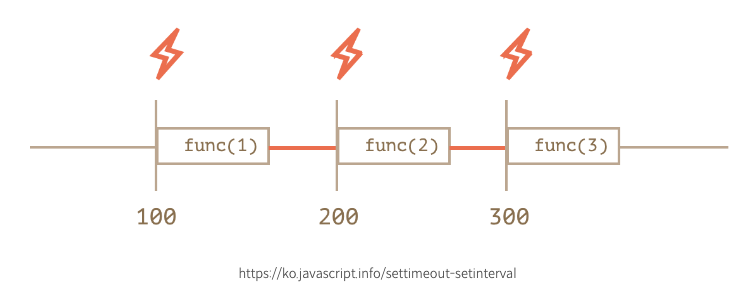

## 들어가며 👋🏻

풀필먼트 서비스 회사이기 때문에 회사에는 2가지 시스템이 있습니다. 하나는 `주문관리시스템` (Order Management Sysyem), 또 다른 하나는 `창고관리시스템` (Warehouse Management Sysyem) 입니다. 기존의 주문 전송 방식은 대량의 업로드 건을 처리하는데 문제가 많았습니다. 그래서 기존에는 업로드할 데이터를 소량씩 짤라서 dispatch 했다면, 새로운 방식으로는 모든 데이터를 한번에 전송하고 batchNumber를 가지고 지속적으로 `polling` 하면서 데이터가 정상적으로 처리되었는지 확인 하는 프로세스를 구축하기로 했습니다.

## polling?

생소하신 분들도 있으리라 생각됩니다. 저 역시 생소한 단어였는데요. 위키 백과에서 찾은 polling의 정의는 다음과 같습니다.

🎃 : **폴링(polling)** 이란 하나의 장치(또는 프로그램)가 충돌 회피 또는 동기화 처리 등을 목적으로 다른 장치(또는 프로그램)의 상태를 **주기적으로 검사** 하여 일정한 조건을 만족할 때 송수신 등의 자료처리를 하는 방식을 말한다.

## 어떻게 주기적으로 검사해야 할까?

결론적으로 말하면 여러 방법이 있겠지만 제가 생각한 방법에는 3가지가 있었습니다.

- setInterval

- setTimeout

- useInterval

주기적으로 특정 callback 함수를 실행 시킬 수 있다면 server에 지속적으로 데이터가 모두 처리 되었는지 질의해 볼 수 있겠다는 결론이 들었습니다.
3가지 방법을 모두 고려해 보고 어떤 것이 가장 좋을지 생각해보았는데 아래에서 찬찬히 살펴보겠습니다.

### setInterval 과 setTimeout의 차이?

어떤 함수를 선택해야 가장 최고의 선택일까요? 물론 원하는 동작마다 다르다고 생각합니다.

하지만 결정적인 차이는 바로 **시간 보장** 입니다. ⏰

```javascript
let timerId = setInterval(func|code, [delay], [arg1], [arg2], ...)
```

> setInterval : 시간마다 주기적으로 해당 func 실행하는 함수.

```javascript
let timerId = setTimeout(func|code, [delay], [arg1], [arg2], ...)
```

> setTimeout : 일정 시간 후에 해당 func 실행하는 함수.

다음 그림을 보면 이해가 쉽습니다.



위의 그림처럼 setInterval은 **함수의 실행 시점 부터 시간을 잡기 때문** 에 실제 함수 호출이 종료되고 다음 함수 호출까지의 시간은 우리가 설정한 시간보다 훨씬 짧아지게 됩니다. 반면에 setTimeout은 해당 시간동안 delay 후 callback 함수가 실행되기 때문에 우리가 설정한 시간만큼 확실히 delay를 보장해 줍니다. 아주 당연한 결과이죠.

따라서 setInterval 함수에서 만약 callback 함수의 실행 시간이 우리가 설정해 놓은 시간보다 길어지면 우리가 원하는 결과를 얻지 못하는 불확실성이 생길 수 있습니다.

즉 setInterval은 주기적으로 callback을 실행 시킬 수 있으나 정확한 시간 보장이 되지 않고, setTimeout은 주기적으로 callback 함수를 실행시킬 수 없지만 시간 보장이 됩니다. 😂

그러면 방법이 없을까요? 방법이 있습니다. setTimeout을 중첩 시키면 됩니다. 🙌

#### 중첩 setTimeout

```javascript
let delay = 5000;

let timerId = setTimeout(function request() {
  ...요청 보내기...

  if (서버 과부하로 인한 요청 실패) {
    // 요청 간격을 늘립니다.
    delay *= 2;
  }

  timerId = setTimeout(request, delay);

}, delay);
```

setTimeout을 중첩하여 사용한다면 확실하게 일정기간만큼 시간을 보장 받을 수도 있고, 들어오는 데이터의 양에 따라 delay를 수정 할 수도 있겠다..! 이 방법이 가장 깔끔하겠어! 😽 라는 기쁨이 들며 코드를 작성했는데 문제가 발생했습니다.

### 클로저?

```javascript
// 클로져 실행 예시. useEffect 안에서 number를 console로 찍어보면 항상 0이다.
// useEffect 밖에서 콘솔을 찍어보면 정상 동작한다.
import { useState, useEffect } from "react"

export default function App() {
  const [number, setNumber] = useState(0)

  console.log("numberOuter", number) // 1초마다 1씩 증가.
  useEffect(() => {
    const loop = setInterval(() => {
      setNumber(prev => prev + 1)
      console.log("numberInner", number) // 항상 0.

      if (number === 10) clearInterval(loop)
    }, 1000)
  }, [])

  return <div className="App">number : {number}</div>
}
```

위와 같은 코드를 단편적으로 보면 어떨까요? 필자는 setState는 비동기이기 때문에 number 값이 즉시 변환되지 않지만, 언젠가 10이 되면 setInterval이 멈추겠지라고 생각했었습니다.

하지만 외부에서 선언된 변수를 setInterval, setTimeOut 함수 내에서 사용했을 때, 값이 변경되지 않았습니다.

numberOuter 콘솔은 1초마다 계속 1씩 증가했는데, numberInner는 0으로 값이 고정되어 setInterval이 멈추지 않았죠,,

이 문제에 대해 계속 찾아보게 되었고 이게 **Closure** 라는 것을 알게되었습니다.

자바스크립트는 함수를 실행하기 위해 실행컨택스트를 구성합니다.

이 실행컨택스트에는 렉시컬 환경(LexicalEnvironment) 이 구성되어 있는데 함수에서 특정 변수에 대한 참조를 가지고 있습니다.

(LexicalEnvironment에 대한 자세한 내용은 [여기](https://sonicce99.github.io/execution-context/)를 참조해주세요)

따라서 setTimeout 외부에서 선언한 변수를 가지고 setTimeout 안에서 실행시킨다면 setTimeout은 종료되었지만 outerEnvironmentReference의 스코프체인으로 인해 과거의 값을 먼저 참조하게 됩니다.

### useRef를 활용해 문제 해결하기

```javascript
import { useState, useEffect, useRef } from "react"

function useInterval(callback, delay) {
  const savedCallback = useRef()

  useEffect(() => {
    savedCallback.current = callback
  }, [callback])

  useEffect(() => {
    function tick() {
      savedCallback.current()
    }
    if (delay !== null) {
      let id = setInterval(tick, delay)
      return () => clearInterval(id)
    }
  }, [delay])
}
```

Closure에 의해 새롭게 렌더링된 값에 접근 할 수 없으므로 React에서는 useRef를 통해 리렌더링을 일으키지 않고 새로운 값을 즉시 참조할 수 있습니다.

useEffect를 통해 callback함수가 update될 경우 해당 값을 current로 유지시키고 아래 useEffect에서 current 값에 접근 함으로서 원하는 결과를 이끌어 낼 수 있습니다.

### 결론.

자. 다시 처음으로 돌아와서 우리의 목적은 서버에 `batchNumber` 를 가지고 데이터가 모두 처리 되었는지 지속적으로 질의해야 했습니다.

#### step1. 우선 polling 함수를 만들자.

```javascript
const longPolling = async () => {
  await waitTime(delay) // 특정 시간만큼 기다림.

  dispatch(Api(batchNumber)) // batchNumber를 가지고 서버에 질의.
}
```

질의를 한번만 하면 안되니 서버에서 response가 올 때까지 `지속적으로` 질의 해야겠죠? 그래서 재귀함수를 통해 longPolling 함수를 반복적으로 실행시켜줍니다.

#### step2. 반복적으로 질의하자.

```javascript
const longPolling = async (delay: number) => {
  await waitTime(delay) // 특정 시간만큼 기다림.

  dispatch(Api(batchNumber)) // batchNumber를 가지고 서버에 질의.

  longPolling(delay) // 서버에 질의 후 다시 함수 실행.
}
```

🌟 재귀함수를 사용했으면 반드시 탈출 조건을 명시해줘야 합니다. 서버에 응답을 받아오면 longPolling 함수를 실행하지 않고 return 할 수 있도록 해줘야겠죠? 어떻게 할 수 있을까요?

```javascript
// Api 실행 후 서버에서 받아오는 response
// Api 실행결과로 다음 3가지가 내려옵니다. batchNumber, successList(wms로 전송 성공한 데이터), failList(전송 실패한 데이터).
const serverResponse = useAppSelector(state => state.store.serverResponse)

const longPolling = async (delay: number) => {
  await waitTime(delay) // 특정 시간만큼 기다림.

  if (serverResponse?.batchNumber) {
    return
  } else {
    dispatch(Api(batchNumber)) // batchNumber를 가지고 서버에 질의.

    longPolling(delay) // 서버에 질의 후 다시 함수 실행.
  }
}
```

❌ 자 위에 처럼 코드를 작성하면 과연 제대로 동작할까요? 아닙니다. 응답이 왔을 경우 serverResponse는 최신의 값을 가지고 있지만, **longPolling 함수 안에서의 serverResponse는 최신화된 값을 참조하지 않기 때문에 응답이 왔음에도 불구하고 탈출하지 못하고 dispatch를 계속하게 됩니다. 따라서 함수를 탈출하기 위해 useRef를 사용해야합니다.**

#### useRef 사용.

```javascript
const serverResponse = useAppSelector(state => state.store.serverResponse)
const serverResponse_ref = useRef(null)

useEffect(() => {
  if (serverResponse?.batchNumber) {
    serverResponse_ref.current = serverResponse
  }
}, [serverResponse])

const longPolling = async (delay: number) => {
  await waitTime(delay) // 특정 시간만큼 기다림.

  if (serverResponse_ref.currnet?.batchNumber) {
    serverResponse_ref.current = null
    return
  } else {
    dispatch(Api(batchNumber)) // batchNumber를 가지고 서버에 질의.

    longPolling(delay) // 서버에 질의 후 다시 함수 실행.
  }
}
```

### 부록. (캡슐화, 은닉화)

클로저는 정보 은닉과 관계가 매우 깊습니다.

javascript는 Prototype 기반 OOP를 가지고 있으며, 이러한 객체 지향 프로그래밍에서 외부 사용자에게 노출이 불필요한 속성, 행위를 노출하는 것은 매우 좋지 않습니다.

나쁜 의도를 가진 사용자가 정보를 조작할 수 있기 때문입니다.

아래는 간단한 counter 클로저입니다.

```javascript
const counter = (() => {
  let privateCounter = 0

  return {
    value: () => privateCounter,
    increment: () => privateCounter++,
    decreasement: () => privateCounter--,
  }
})()

console.log(counter.value()) // 0
counter.increment()
console.log(counter.value()) // 1
counter.decreasement()
console.log(counter.value()) // 0
```

console.log를 통해 privateCounter에 접근하고 싶습니다. 그런데 방법이 있나요?

방법이 없습니다. 우리는 클로저를 사용하여 privateCounter를 은닉할 수 있고 사용자는 privateCounter 변수의 존재 여부에 대해 알 수 없습니다.

즉 counter를 사용하는 사용자는 철저히 value, increment, decreasement를 통해 privateCounter를 조회, 증가, 감소 하는 행위만을 할 수 있습니다.

### 마치며.

polling 방식으로 데이터를 처리하기 위해 공부를 하면서 `비동기 데이터 처리방식`에 대해서 많이 공부할 수 있었던 계기가 되었다. 더 열심히 해서 우아한 코드를 작성할 수 있는, 더 좋은 동료가 되기 위해 노력해야겠다. 그리고 항상 좋은 advice를 해주시는 조수관 기술 이사님께 감사함을 느낀다. 🙏🏻

#### 참조

아래는 이 글을 작성하며 참조한 블로그입니다.

- [React에서 setInterval 현명하게 사용하기(feat. useInterval)](https://mingule.tistory.com/65)
